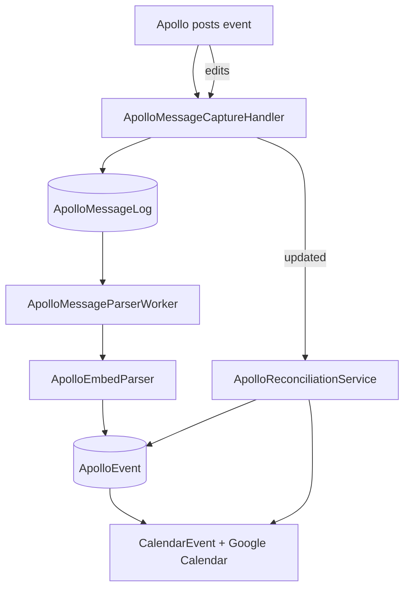

# Apollo Integration

Apollo is a third-party Discord bot that posts event embeds with RSVP buttons. ClanGuard captures those embeds, parses them into structured `ApolloEvent` records, and syncs them to Google Calendar so officers see the same schedule outside Discord.

## Pipeline



## Components

| File | Role |
|---|---|
| `ApolloMessageCaptureHandler.cs` | Subscribes to `MessageReceived` and `MessageUpdated`. Filters by `ApolloBotName`. Persists raw messages to `ApolloMessageLog`. |
| `ApolloMessageLog.cs` (entity) | Raw audit log of every captured Apollo message. |
| `ApolloMessageParserWorker.cs` | Background worker that pulls unparsed `ApolloMessageLog` rows and runs them through the parser. |
| `ApolloEmbedParser.cs` | Pure parser. Takes Apollo embed JSON, returns a structured `ApolloEvent`. |
| `ApolloEmbedReconstructor.cs` | Inverse: rebuild a synthetic embed from a stored `ApolloEvent` (used for the calendar event description). |
| `ApolloEvent.cs` (entity) | Parsed event record: title, time, RSVP counts, etc. |
| `ApolloEventHandler.cs` | Coordinates the parsed-event → calendar sync. |
| `ApolloReconciliationService.cs` | Periodic reconciliation: re-parse, re-sync, drop calendar dupes. |
| `ApolloBackfillService.cs` | One-shot historical backfill of older Apollo messages on startup if the log is short. |

## Why we cache 500 messages

Discord doesn't deliver `MessageUpdated` for messages outside the gateway cache. Apollo edits the same message repeatedly to reflect RSVP changes, so without a cache the bot would only see the original post and miss every update.

`MessageCacheSize = 500` (set in `Program.cs`) is the compromise between memory use and reliable update capture across short bot restarts.

## Capture flow

1. Apollo posts an embed in `#events`.
2. `ApolloMessageCaptureHandler.OnMessageReceived` fires:
    - Confirms `Author.Username == ApolloBotName`.
    - Persists the full message JSON to `ApolloMessageLog` with `ParsedAt = NULL`.
3. `ApolloMessageParserWorker` polls for unparsed rows.
4. `ApolloEmbedParser` extracts:
    - Event title
    - Start time (with timezone)
    - End time (or duration → end)
    - Attendee list per RSVP status (Accepted / Declined / Tentative / etc.)
5. The result is upserted to `ApolloEvent` (keyed by Apollo message ID).
6. `ApolloEventHandler` syncs to Google Calendar via `GoogleCalendarService`. The calendar event's description includes a reconstructed text version of the embed for officers viewing the calendar directly.
7. `ApolloMessageLog.ParsedAt` is stamped so the worker doesn't re-process.

When Apollo edits the message:

1. `OnMessageUpdated` fires.
2. Fresh `ApolloMessageLog` row is appended (we keep the audit trail of every revision).
3. Worker re-parses; `ApolloEvent` is updated by Apollo message ID.
4. Calendar event is updated in place.

## Reconciliation

`ApolloReconciliationService` runs on a schedule and:

- Re-parses any `ApolloMessageLog` rows where parsing previously failed.
- Detects orphan `CalendarEvent` rows (no matching `ApolloEvent`) and removes them.
- Detects duplicate calendar events (same `ApolloEvent`, multiple `CalendarEvent` rows) and removes the extras.

`/cleanup-calendar-dupes` (MAJ+) triggers reconciliation manually.

## Parser landmines

!!! danger "Smart punctuation crashes the parser"
    Curly quotes (`"` `"`), em-dashes (`—`), and other smart-punctuation characters in event titles have crashed `ApolloEmbedParser` historically. If a new Apollo embed format is introduced or a member uses unusual characters, parsing fails and the row stays unparsed in `ApolloMessageLog`.

    **Mitigation:** check `ApolloMessageParserWorker` logs for parse failures. The fix is usually to broaden the parser's character handling, not to ask members to change their input.

!!! warning "Apollo can change its embed format"
    Apollo's embed structure has evolved before. If new events stop appearing, first thing to check is whether the embed shape has changed:

    ```sql
    SELECT MessageId, RawJson FROM ApolloMessageLog
    ORDER BY CapturedAt DESC LIMIT 1;
    ```

    Compare against the parser's expected fields.

!!! warning "Timestamp handling"
    Earlier versions of the parser had a bug with Apollo embed timestamps where the parser's date conversion misinterpreted the embed's epoch field. The fix landed during recent work — if events start showing up at obviously wrong times (off by a day or in the wrong year), regression-test against `ApolloMessageLog` raw JSON.

## RSVP counts

`ApolloEvent` stores attendee user IDs per RSVP bucket. These feed into:

- The grouped event announcement
- Event attendance calculations (cross-referenced with `EventAttendance` voice presence)

## Calendar event description

`ApolloEmbedReconstructor` rebuilds a markdown-style description from a stored `ApolloEvent`, used as the Google Calendar event description. This way officers viewing the calendar in Google get the same structured info they'd see in Discord, even though the calendar can't render Discord embed formatting.

## Backfill

`ApolloBackfillService` runs once on startup. If `ApolloMessageLog` has fewer than N entries, it pulls the last N messages from the events channel where the author was Apollo, persists them, and lets the parser worker handle them. This is how a fresh bot deployment catches up on recent events.

## Common operational questions

??? question "An event is missing from the calendar."
    1. Check `ApolloMessageLog` for the original message — was it captured?
    2. If captured, check `ParsedAt` — was it parsed?
    3. If parsed, check `ApolloEvent` for the row.
    4. If `ApolloEvent` exists but the calendar event is missing, run `/cleanup-calendar-dupes` (which also re-syncs missing events).

??? question "An event is on the calendar twice."
    Almost always Apollo edited the original and the previous calendar entry didn't get cleaned up. Run `/cleanup-calendar-dupes`. If duplicates persist, check `CalendarEvent` rows by `ApolloEventId` to see what's actually mapped.

??? question "RSVP counts are wrong."
    Capture happens on `MessageUpdated`. If the bot was offline during an edit and the message has since fallen out of the 500-message cache, the latest state isn't captured. The next edit will refresh things. To force a re-fetch, an officer can edit the embed (Apollo will repost) or wait for the next reconciliation cycle.
