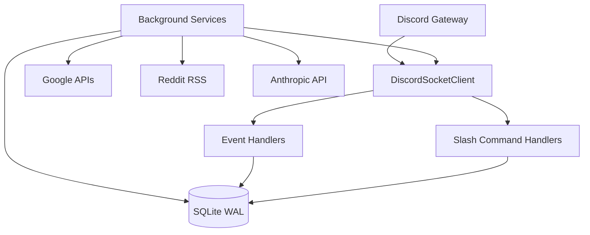

# Architecture

## High-level shape

ClanGuard is a single-process .NET 8 Worker host. Discord.Net's `DiscordSocketClient` is registered as a singleton and shared across every handler and background service. The whole bot — including all background services — runs in one container, with a SQLite database in WAL mode on a mounted Docker volume.



## Project layout

```
ClanGuardBot/
├── Program.cs                 # Composition root: DI, Serilog, host startup
├── appsettings.json           # Default config (token via env var)
├── appsettings.Production.json
├── Dockerfile                 # multi-stage; sqlite3 CLI included for inspection
├── docker-compose.yml         # bot-data + bot-logs volumes, google-credentials.json mount
│
├── BotConfig.cs               # Strongly-typed config (BotConfig section)
├── Entities.cs                # All EF Core entity types
├── BotDbContext.cs            # DbContext + DbSet declarations
├── Migrations/                # EF Core migrations history
│
├── DiscordBotService.cs       # Bot lifecycle, command registration, ready hook
│
├── *Handler.cs                # Discord event + slash command handlers
├── *Service.cs                # Long-running background services (IHostedService)
│
├── AI/ClaudeAiService.cs      # Anthropic API client wrapper
├── Briefing/                  # Weekly officer briefing pipeline
├── PatrolWatch/               # Squad detection in LFG voice
└── RedditLeads/               # Recruitment lead detection
```

## Composition: how things wire up

`Program.cs` is the composition root. The order of registrations matters in a few places — most notably:

- `OnboardingReminderHandler` is registered **before** `GamertagCommandHandler` because the gamertag handler depends on it to notify when a Guest saves gamertags.
- `PromotionService` is registered **before** `PromoteCommandHandler` and `AutoPromotionService` because both consume it.
- All `IHostedService` background services are added with `AddHostedService(sp => sp.GetRequiredService<T>())` rather than `AddHostedService<T>()` so the same instance is also resolvable by other services that need to call into it.

## Handler vs. Service

The codebase uses two roles:

- **Handler** (`*Handler.cs`) — subscribes to Discord events (`MessageReceived`, `UserVoiceStateUpdated`, `InteractionCreated`, etc.) and processes them inline. Registered as singleton so subscriptions persist for the lifetime of the bot.
- **Service** (`*Service.cs`) — long-running background work. Implements `IHostedService` (or `BackgroundService`) and runs on its own loop.

A handful of services are also `IHostedService` *and* exposed for direct injection (e.g. `EventAttendanceSnapshotService` is queried by `AutoPromotionService`).

## Background loop cadences

| Service | Cadence | Configurable via |
|---|---|---|
| `AwolCheckService` | `CheckIntervalMinutes` (default 180) | `BotConfig.CheckIntervalMinutes` |
| `AutoPromotionService` | Once daily at `AutoPromotionRunHourUtc` | `BotConfig.AutoPromotionRunHourUtc` |
| `EventAttendanceSnapshotService` | `EventAttendanceSnapshotIntervalMinutes` (5) | `BotConfig.EventAttendanceSnapshotIntervalMinutes` |
| `RosterExportService` | Once daily at `RosterExportHourUtc` | `BotConfig.RosterExportHourUtc` |
| `RedditLeadService` | `PollingIntervalMinutes` (10) | `RedditLeads.PollingIntervalMinutes` |
| `WeeklyOfficerBriefingService` | Weekly at `WeeklyBriefing.RunOnDayUtc` / `RunAtUtc` | `WeeklyBriefing` config |
| `CommandUsagePruneService` | Daily | hard-coded |
| `VoiceSessionCleanupService` | On startup + recurring reconciliation | hard-coded |

## Discord client config

```csharp
var discordConfig = new DiscordSocketConfig
{
    GatewayIntents = GatewayIntents.Guilds
                   | GatewayIntents.GuildMessages
                   | GatewayIntents.GuildMembers
                   | GatewayIntents.GuildVoiceStates
                   | GatewayIntents.GuildInvites
                   | GatewayIntents.GuildPresences
                   | GatewayIntents.MessageContent,
    AlwaysDownloadUsers = true,
    LogLevel            = LogSeverity.Info,
    MessageCacheSize    = 500
};
```

!!! note "Why MessageCacheSize = 500"
    Apollo posts events as messages and edits them in place to update RSVP counts. We cache the most recent 500 messages per channel so `MessageUpdated` fires reliably for Apollo edits even after a short bot restart. See [Apollo Integration](apollo-integration.md).

!!! warning "Privileged intents"
    `Presence`, `Members`, and `Message Content` are all **privileged intents** and must be enabled in the Discord Developer Portal under **Bot → Privileged Gateway Intents**, otherwise the bot will fail to connect.

## Logging

Serilog writes to:

- **Console** — captured by Docker, viewable via `docker compose logs -f`
- **Rolling file** — `logs/clanguard-YYYYMMDD.log`, retained for 14 days, mounted as the `bot-logs` volume

To raise log level temporarily, set `Logging__LogLevel__Default=Debug` in the environment and recreate the container.

## Database

SQLite, single file at `/app/data/clanguard.db` inside the container, persisted via the `bot-data` named volume. WAL mode is enabled.

See [Database Schema](database.md) for the full entity reference.

## External dependencies

| Service | Used for | Auth |
|---|---|---|
| Discord Gateway/REST | Everything | Bot token (`BotConfig__Token` env var) |
| Google Sheets API | Roster export, gamertag log, recruit log | Service account JSON (`google-credentials.json`) |
| Google Calendar API | Apollo event sync, comp event creation | Same service account |
| Anthropic API | Weekly officer briefing | `Claude__ApiKey` env var |
| Reddit (public RSS) | Reddit Leads | None (User-Agent only) |
