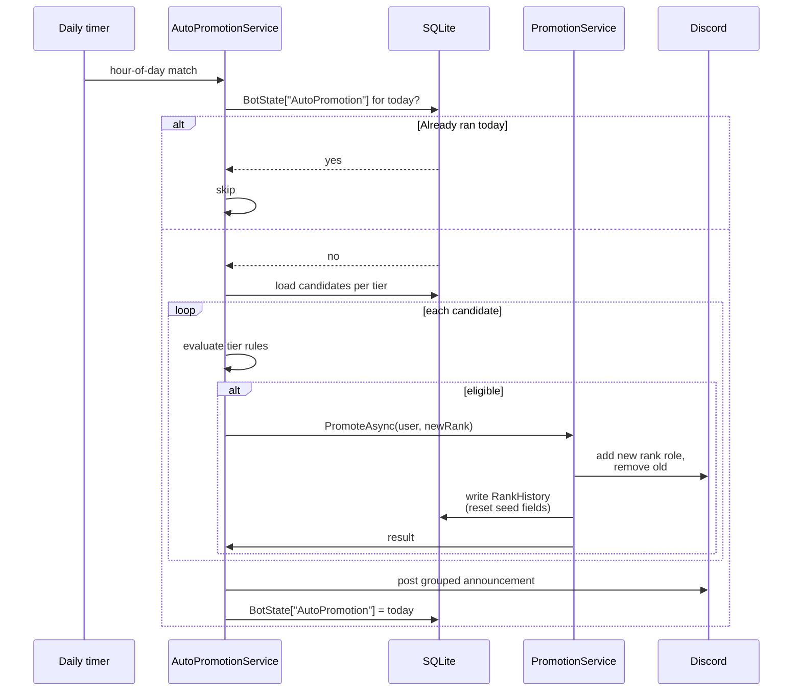

# Auto-Promotion

Daily background sweep that promotes members who meet tier-specific thresholds. Replaces the manual spreadsheet workflow.

## Tiers

The system runs in tiers, each with its own thresholds. Currently configured tiers:

- **RCT → CPL** — junior enlisted progression
- **CPL → SGT** — NCO step

Each tier evaluates time-in-rank, message activity, and event attendance. A user is promoted when *all* tier thresholds are met.

!!! note "Above SGT is manual"
    Promotions to SSG and above are intentionally manual (`/promote`). The bot stops at SGT.

## Components

| File | Role |
|---|---|
| `AutoPromotionService.cs` | The daily sweep. Pulls candidates, evaluates tier rules, applies promotion via `PromotionService`. |
| `PromotionService.cs` | Shared core used by both `AutoPromotionService` and `/promote`. Builds and posts the announcement, updates Discord roles, writes `RankHistory`. |
| `EventAttendanceSnapshotService.cs` | Samples voice presence in the EVENTS category every `EventAttendanceSnapshotIntervalMinutes`. Source of truth for event attendance counts. |
| `BotState` (entity) | Cycle-completion marker. Prevents double-runs the same day. |
| `RankHistory` (entity) | Time-in-rank ground truth. |

## Daily cycle

Runs once per day at `AutoPromotionRunHourUtc` (default 3 UTC).



## Grouped announcement format

Earlier versions posted one message per promotion. The current behaviour groups all promotions from a cycle into a single announcement using randomized templates, posted to `AutoPromotionAnnouncementChannel` / `AutoPromotionAnnouncementChannelId`. Templates live inline in `PromotionService`.

The announcement embed includes the 189th logo footer, copied from `Assets/189th_logo.png` at publish time (declared in `ClanGuardBot.csproj`).

## Tier rule evaluation

Each tier has a rule set conceptually:

```
days_in_rank >= MIN_DAYS
AND messages_in_rank >= MIN_MESSAGES
AND qualifying_events_attended_at_rank >= MIN_EVENTS
```

"Qualifying events attended" is computed as:

```
seed (from spreadsheet, if applied)
+ COUNT(EventAttendance rows where:
    UserId = candidate
    AND MinutesAttended >= AutoPromotionMinEventAttendanceMinutes (30)
    AND CalendarEvent.EndUtc > COALESCE(SeedAppliedAt, RankHistory.AssignedAt))
```

`AutoPromotionEventBufferMinutes` (default 30) provides a buffer on either side of the event window when associating a `VoiceSession` with a `CalendarEvent`.

## Seed fields

When the bot took over from the manual spreadsheet, members already had event credit accumulated under their current rank. To avoid losing that credit, two fields exist on `RankHistory`:

| Field | Meaning |
|---|---|
| `EventsAttendedAtRankBeforeBot` | Count of qualifying events at this rank, copied from the "Seed Events" column of the roster sheet. |
| `SeedAppliedAt` | Timestamp the seed was applied. Bot-tracked events with `EndUtc < SeedAppliedAt` are **not** counted again — they're assumed to already be reflected in the seed. |

The seed is applied via the one-time `/seed-promotion-credit` command, which reads the "Seed Events" column from the roster sheet and writes it into the database.

!!! danger "Seeds reset on rank change"
    When `RankName` changes, both seed fields **must** be reset to `0` and `null` respectively. A new rank is a fresh count, not an inheritance. Every code path that mutates `RankHistory` on rank change is responsible for this reset:

    - `RosterExportService` (when the export detects a new rank)
    - `RankTrackingHandler` (realtime role-change events)
    - `PromoteCommandHandler` / `DemoteCommandHandler`
    - `AutoPromotionService` itself

    Forgetting this means the next promotion at the new rank will incorrectly include the previous rank's seed.

## Dry-run modes

Two flags in `BotConfig`:

- `AutoPromotionDryRun` — global. When `true`, every tier logs decisions but does not apply promotions or post announcements.
- `AutoPromotionDryRunRanks` — comma-separated. Only the listed ranks run dry; other tiers continue to promote for real. Use this when rolling out a tier change without freezing the whole pipeline.

Dry-run output is logged at `Information` level and is the source of truth for "would have promoted" decisions.

## Manual override

`/promote <user> [rank]` (MAJ+) goes through the same `PromotionService` core as auto-promotion. If `[rank]` is omitted, the user is promoted by one tier per `RankRoles`. The announcement format is the same.

`/demote <user> [rank]` is the inverse. Note that a demotion **also** resets the seed fields on the new (lower) `RankHistory` record — same rule as promotions.

## Ad-hoc credit

`/add-event-credit <user> <count>` and `/remove-event-credit <user> <count>` (MAJ+) adjust event credit ad-hoc when something happened that the bot couldn't observe (e.g. an off-platform event, a member who was present but Discord status broke).

These adjust `RankHistory.EventsAttendedAtRankBeforeBot` directly — effectively "bumping the seed". They don't create `EventAttendance` rows.

## Common operational questions

??? question "Why didn't user X get auto-promoted?"
    Run through:

    1. Is `AutoPromotionEnabled` `true`? Is `AutoPromotionDryRun` `false`?
    2. Is X's current rank in the auto-promotion tier list (RCT→CPL→SGT)?
    3. Time-in-rank: `julianday('now') - julianday(RankHistory.AssignedAt)` ≥ tier minimum?
    4. Message count at rank: enough messages since `AssignedAt`?
    5. Event attendance: seed + bot-tracked qualifying events ≥ tier minimum?
    6. Was the daily run hit at all? Check `BotState["AutoPromotion"]`.

??? question "Why did the same person get announced twice?"
    The cycle marker (`BotState["AutoPromotion"]`) prevents double-runs in the same day, but a bot restart mid-cycle could in theory re-process candidates. If you see this, check whether the announcement was actually posted twice or just the role was updated twice. The announcement is always built once at the end of the cycle.

??? question "Can I see the dry-run output?"
    Yes — `docker compose logs clanguard | grep -i AutoPromotion`. Dry-run decisions are at `Information` level with the user, current rank, target rank, and the rule trace.

??? question "How do I stop a tier from auto-promoting while I tweak it?"
    Set `AutoPromotionDryRunRanks=PVT,PFC` (or whichever) and redeploy. Only those tiers run dry; others continue.
