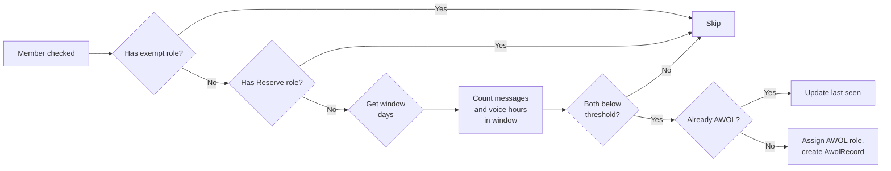
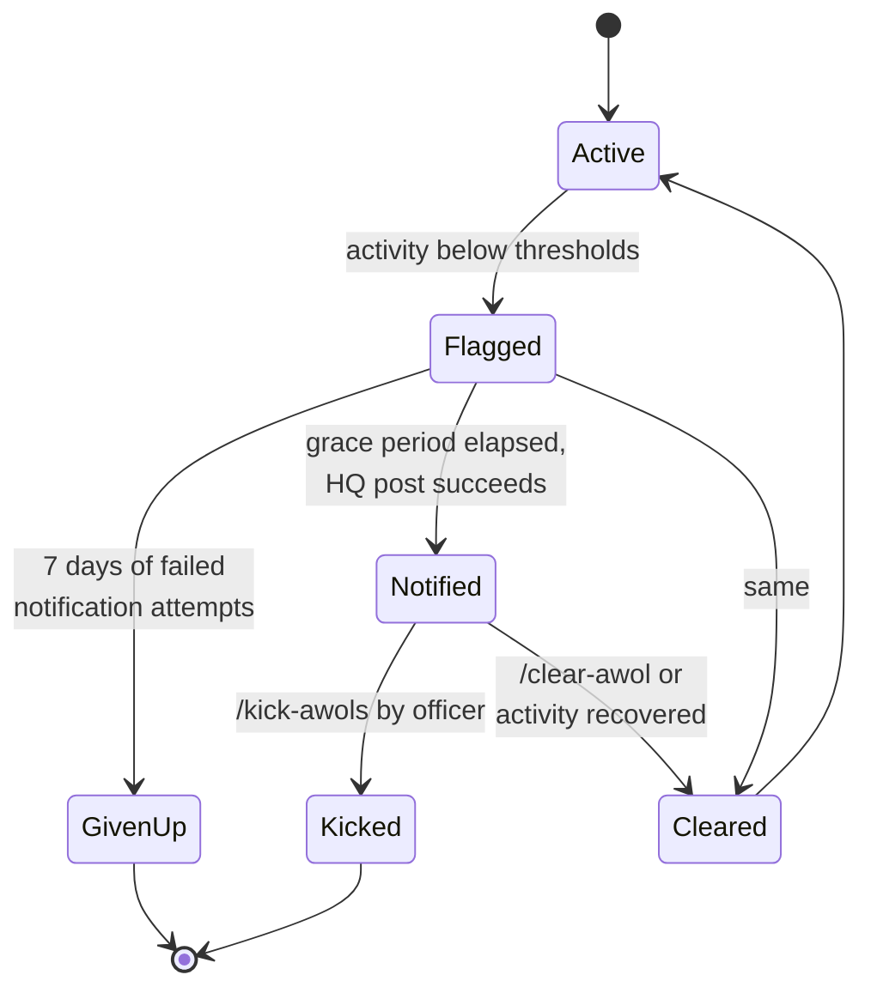

# AWOL System

## What it does

Identifies members whose recent activity has fallen below the configured thresholds, assigns the AWOL role, posts a notification to the AWOL channel after a grace period, and provides a senior-officer command to kick those members.

Reserve role members are **fully exempt** from every step.

## Activity thresholds

A user is flagged AWOL when they have **both** fewer than `MinMessages` (default 5) **and** less than `MinVoiceHours` (default 1.0) within their activity window. Meeting either threshold keeps them safe.

The window is `WindowDays` (default 28) for everyone, except members holding any role in `ShortWindowRoles` (default `Guest,RCT`), who use `ShortWindowDays` (default 14). The shorter window means new members and guests are evaluated on a faster cycle.



## Lifecycle



### State transitions

| From | To | Trigger |
|---|---|---|
| Active → Flagged | `AwolCheckService` cycle finds activity below thresholds. AWOL role assigned, `AwolRecord` row created. |
| Flagged → Notified | `AwolGraceDays` (default 2) have elapsed since `AssignedAt`. Notification posted to `HqChannelName`. `NotificationSent=true`. |
| Flagged → GivenUp | 7 days have elapsed since `AssignedAt` and notification has failed every time. Record auto-resolved. |
| Notified → Kicked | Senior officer runs `/kick-awols`. Audit row written to `AwolKickAuditRecord`. |
| Notified/Flagged → Cleared | Officer runs `/clear-awol`, or activity recovers above thresholds. AWOL role removed, record marked resolved. |

## Components

| File | Responsibility |
|---|---|
| `AwolCheckService.cs` | Background loop. Runs every `CheckIntervalMinutes`. Identifies AWOL candidates, assigns/clears the role, posts notifications. |
| `AwolRecord` (entity) | One row per current AWOL state per user. |
| `AwolKickAuditRecord` (entity) | Audit row per kick. |
| `KickAwolsCommandHandler.cs` | `/kick-awols` slash command (MAJ+). |
| `ClearAwolListCommandHandler.cs` | `/clear-awol-list` slash command (MAJ+). |
| `SlashCommandHandler.cs` | `/awol-status`, `/awol-check`, `/clear-awol` |

## Notification retry & give-up policy

`AwolRecord.LastNotificationAttemptUtc` is stamped on **every** attempt to post the notification — successful or not. This lets the service distinguish three states:

| `NotificationSent` | `LastNotificationAttemptUtc` | Meaning |
|---|---|---|
| `false` | `null` | Fresh record, grace period not yet elapsed. |
| `false` | `DateTime` | Has tried at least once, all attempts failed. |
| `true`  | `DateTime` | Successfully notified. |

Records in row 2 that were assigned 7+ days ago are auto-resolved as "given up" — they stop occupying the pending queue. If the underlying problem (deleted channel, revoked permissions) is later fixed and the user is still inactive, a fresh `AwolRecord` will be created on the next cycle.

## Reserve exemption

Reserve members have an explicit doctrinal meaning ("active but paused") and are tracked separately from `ExemptRoles` for that reason. The check is in `AwolCheckService` and looks for the role named in `BotConfig.ReserveRoleName` (default `Reserve`). Reserve members:

- Are never assigned the AWOL role.
- Are never kicked by `/kick-awols`.
- Can still use `/awol-status` and see their stats.

If you wanted to convert someone to a long-term exemption, give them a role from `ExemptRoles` instead. Reserve is for temporary pauses.

## Kicking

`/kick-awols` (MAJ+) iterates the current AWOL set, skips Reserve, kicks each member from the guild, and writes an audit row per kick to `AwolKickAuditRecord`.

```mermaid
flowchart TB
    Cmd[/kick-awols] --> Auth{Invoker MAJ+?}
    Auth -->|No| Deny[Reject ephemeral]
    Auth -->|Yes| Iter[For each AwolRecord<br/>where notified]
    Iter --> Reserve{Has Reserve role?}
    Reserve -->|Yes| Skip[Skip, log reason]
    Reserve -->|No| Notified{Notification sent?}
    Notified -->|No| Skip
    Notified -->|Yes| Kick[Kick member]
    Kick --> Audit[Write AwolKickAuditRecord]
    Audit --> Iter
```

## Self-healing

`AwolCheckService` reconciles state every cycle. If a member has the AWOL role but no `AwolRecord` (e.g. role was assigned manually, or DB was restored from backup), one is created. If a member has an `AwolRecord` but no AWOL role, the record is closed out as cleared.

## Common operational questions

??? question "Why didn't user X get flagged when they're clearly inactive?"
    Most common causes:

    1. They have an `ExemptRoles` role (Admin, Moderator, Retired, Bot, Bot Whisperer).
    2. They have the Reserve role.
    3. Their window hasn't fully elapsed yet — new members get a grace period as their window opens.
    4. They have **either** ≥ `MinMessages` messages or ≥ `MinVoiceHours` hours. Meeting either keeps them safe.

??? question "Why did the same notification post twice?"
    A bot restart between "post" and "save NotificationSent=true". The notification posted, but the DB write didn't commit. On the next cycle the record looks unsent, so it posts again. Mitigation: the post-then-save sequence is order-of-operations critical and should be reviewed if this happens repeatedly.

??? question "Can I bulk-clear the AWOL list?"
    `/clear-awol-list` (MAJ+) clears the entire pending queue. Use with care — it removes the AWOL role from everyone and deletes all `AwolRecord` rows.

??? question "Where do I see the kick history?"
    `AwolKickAuditRecord` table. There's no slash command surface for it yet, but you can query directly:
    ```sql
    SELECT * FROM AwolKickAuditRecord ORDER BY KickedAt DESC LIMIT 50;
    ```
