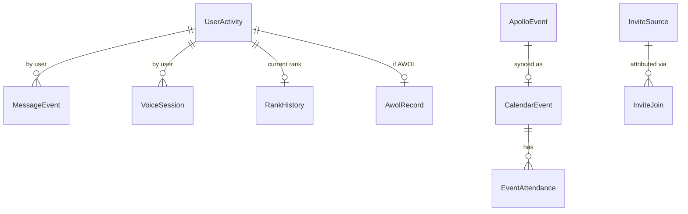

# Database Schema

SQLite, WAL mode, single file at `/app/data/clanguard.db`. Managed via EF Core migrations under `Migrations/`. The DbContext is `BotDbContext` and every entity lives in `Entities.cs`.

## Tables

| Entity | Purpose |
|---|---|
| `UserActivity` | One row per user/guild. Tracks current voice-join timestamp. |
| `MessageEvent` | One row per message sent by a tracked user. Used for rolling-window counts. |
| `VoiceSession` | One row per voice join → leave. Used for voice-time accounting and event attendance. |
| `RankHistory` | When a user was assigned their current rank. Drives time-in-rank for promotion. |
| `AwolRecord` | When a user was assigned the AWOL role; tracks notification state. |
| `AwolKickAuditRecord` | Audit trail of `/kick-awols` invocations. |
| `TicketReminder` | Pending ticket center reminders. |
| `GuestReminder` | Pending guest upgrade reminders. |
| `OnboardingReminder` | Pending RCT onboarding reminders. |
| `CalendarEvent` | Apollo events synced to Google Calendar. |
| `EventAttendance` | Per-user voice presence snapshots during an event. |
| `BotState` | Cycle-completion markers for daily background services (auto-promotion, etc.). |
| `BumpState` | Last Disboard bump time per guild. |
| `ApolloMessageLog` | Raw captured Apollo messages (audit/replay). |
| `ApolloEvent` | Parsed Apollo event records. |
| `InviteSource` | Named invite codes (e.g. "Reddit Battlefield6"). |
| `InviteJoin` | Per-join attribution to an `InviteSource`. |
| `RedditLead` | Detected recruitment leads from monitored subreddits. |
| `CommandUsage` | Slash command invocation tracking (for `/usage-stats`). |
| `PatrolWatchOptOut` | Users who opted out of squad-formed alerts. |

## Key relationships



The "key" composite for activity rows is `(GuildId, UserId)`. Most queries filter by `GuildId` first since the bot is multi-guild capable in principle, even though it's only deployed to one server today.

## Notable entities

### `UserActivity`

```csharp
public class UserActivity
{
    public int Id { get; set; }
    public ulong GuildId { get; set; }
    public ulong UserId { get; set; }
    public string Username { get; set; } = string.Empty;
    public DateTime? VoiceJoinedAt { get; set; }
}
```

Stores the *currently in-progress* voice join time. When a user leaves voice, `VoiceJoinedAt` is cleared and a `VoiceSession` row is closed out with `LeftAt`.

### `VoiceSession`

```csharp
public class VoiceSession
{
    public int Id { get; set; }
    public ulong GuildId { get; set; }
    public ulong UserId { get; set; }
    public DateTime JoinedAt { get; set; }
    public DateTime? LeftAt { get; set; }
    public ulong? ChannelId { get; set; }
    public string? ChannelName { get; set; }
    public ulong? CategoryId { get; set; }   // captured at join
}
```

`CategoryId` is captured at the moment of join. This matters: temporary event VCs may be deleted before the attendance snapshot runs, so we can't look up the category later. Sessions recorded before this column existed have `CategoryId = NULL` and fall back to the legacy `EventsVoiceChannelId` check.

### `RankHistory`

```csharp
public class RankHistory
{
    public int Id { get; set; }
    public ulong GuildId { get; set; }
    public ulong UserId { get; set; }
    public string RankName { get; set; } = string.Empty;
    public DateTime AssignedAt { get; set; }
    public int EventsAttendedAtRankBeforeBot { get; set; }   // seed
    public DateTime? SeedAppliedAt { get; set; }             // seed timestamp
}
```

`EventsAttendedAtRankBeforeBot` and `SeedAppliedAt` exist for the migration from the manual promotion spreadsheet to bot-tracked attendance. See [Auto-Promotion](auto-promotion.md#seed-fields) for the full semantics.

!!! danger "Reset seeds on rank change"
    Both seed fields **must** be reset whenever `RankName` changes. A new rank means a fresh count, not an inheritance. Every code path that mutates `RankHistory` on rank change is responsible for zeroing these fields at the same time. Affected paths:

    - `RosterExportService` (when the export detects a new rank)
    - `RankTrackingHandler` (realtime role-change events)
    - `PromoteCommandHandler` / `DemoteCommandHandler`
    - `AutoPromotionService`

### `AwolRecord`

```csharp
public class AwolRecord
{
    public int Id { get; set; }
    public ulong GuildId { get; set; }
    public ulong UserId { get; set; }
    public string Username { get; set; } = string.Empty;
    public DateTime AssignedAt { get; set; }
    public bool NotificationSent { get; set; }
    public DateTime? NotificationSentAt { get; set; }
    public DateTime? LastNotificationAttemptUtc { get; set; }   // every attempt
}
```

`LastNotificationAttemptUtc` is stamped on **every** notification attempt regardless of success. Records that have been attempted repeatedly without success for 7+ days get auto-resolved as "given up" so they don't loop forever in the pending queue. See `AwolCheckService` for the full retry policy.

### `BotState`

A small key/value store keyed by service name. `AutoPromotionService` writes the last successful cycle date; the next run skips if the cycle is already complete for the day. Add new keys as needed for any new daily background service.

### `EventAttendance`

```csharp
public class EventAttendance
{
    public int Id { get; set; }
    public int CalendarEventId { get; set; }
    public ulong UserId { get; set; }
    public string Username { get; set; } = string.Empty;   // captured snapshot
    public int MinutesAttended { get; set; }
    public DateTime? LastSnapshotAt { get; set; }
}
```

`Username` is captured at first snapshot rather than resolved on read, so historical attendance reads correctly even after a member's display name changes.

## Migrations

All migrations live in `Migrations/`. Significant ones:

| Migration | What it added |
|---|---|
| `EventBasedTracking` | `MessageEvent`, `VoiceSession` (replaces aggregate counters) |
| `AddRosterTracking` | `RankHistory` |
| `AddTicketReminders` / `AddGuestReminders` / `AddOnboardingReminders` | Reminder tables |
| `AddCalendarEvents` / `AddCalendarEventDescription` / `AddCalendarEventLastSnapshotAttempt` | Calendar sync state |
| `AddEventAttendance` / `AddUsernameToEventAttendance` | Event attendance tracking |
| `AddVoiceSessionCategoryId` | `VoiceSession.CategoryId` for event attendance |
| `AddRankHistorySeedFields` | Seed fields on `RankHistory` |
| `AddBotState` | Daily-cycle markers |
| `AddAwolRecordLastNotificationAttempt` | Retry tracking |
| `AddBumpState` | Disboard bump throttling |
| `AddAwolKickAuditRecords` | Kick audit trail |
| `AddApolloCapturePhase12` | Apollo capture/parse pipeline |
| `AddInviteTracking` | `InviteSource`, `InviteJoin` |
| `AddRedditLeads` | `RedditLead` |
| `AddCommandUsage` | Per-command usage tracking |
| `AddPatrolWatchOptOut` | Squad alert opt-out |

### Adding a migration

```bash
dotnet ef migrations add MyNewMigration
# Review the generated *.cs file before committing.
# The bot applies pending migrations on startup automatically.
```

If a migration is committed but the production DB has already drifted, `dotnet ef database update --force` is **not** appropriate — restore from backup and re-apply migrations cleanly.

## Useful queries

### Top voice-time users (last 28 days)

```sql
SELECT
    UserId,
    ROUND(SUM(
        (julianday(COALESCE(LeftAt, datetime('now'))) - julianday(JoinedAt)) * 24
    ), 2) AS hours
FROM VoiceSession
WHERE JoinedAt > datetime('now', '-28 days')
GROUP BY UserId
ORDER BY hours DESC
LIMIT 20;
```

### Pending AWOL queue (not yet notified)

```sql
SELECT UserId, Username, AssignedAt, LastNotificationAttemptUtc
FROM AwolRecord
WHERE NotificationSent = 0
ORDER BY AssignedAt;
```

### Members eligible for promotion at their current rank

(The full logic lives in `AutoPromotionService`; this is just a starting point.)

```sql
SELECT
    rh.UserId,
    rh.RankName,
    rh.AssignedAt,
    julianday('now') - julianday(rh.AssignedAt) AS days_in_rank,
    rh.EventsAttendedAtRankBeforeBot AS seed,
    (SELECT COUNT(*)
     FROM EventAttendance ea
     JOIN CalendarEvent ce ON ea.CalendarEventId = ce.Id
     WHERE ea.UserId = rh.UserId
       AND ea.MinutesAttended >= 30
       AND ce.EndUtc > COALESCE(rh.SeedAppliedAt, rh.AssignedAt)
    ) AS bot_events
FROM RankHistory rh;
```
