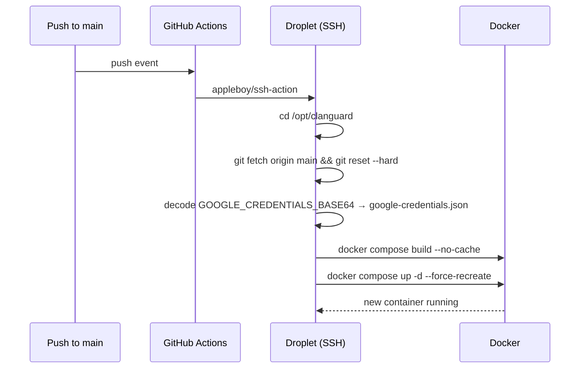

# Deployment & Infrastructure

## Production environment

- **Provider:** DigitalOcean
- **Droplet:** `ubuntu-clanbot-nyc3`, Ubuntu 24.04, NYC3 region
- **Container:** `clanguard-bot` (defined in `docker-compose.yml`)
- **Working directory on host:** `/opt/clanguard`
- **Database location:** `/app/data/clanguard.db` (inside container) → `bot-data` named Docker volume
- **Logs:** `/app/logs/clanguard-YYYYMMDD.log` → `bot-logs` named volume
- **Google credentials:** `/opt/clanguard/google-credentials.json` mounted read-only at `/app/google-credentials.json`

## CI/CD pipeline

Located at `.github/workflows/deploy.yml` in the bot repo. Triggered on push to `main`.



!!! danger "Stale container landmine"
    `docker compose up -d` alone will reuse the existing container if compose thinks nothing changed. Always use `--force-recreate`, and `--no-cache` on the build step, otherwise old code keeps running and you'll spend an hour confused. The current workflow does both.

### Required GitHub Actions secrets

| Secret | Purpose |
|---|---|
| `DROPLET_HOST` | IP or hostname of the droplet |
| `DROPLET_SSH_KEY` | Private SSH key for `root@droplet` |
| `GH_PAT` | GitHub PAT with `repo` scope, used to set the origin URL for `git fetch` |
| `GOOGLE_CREDENTIALS_BASE64` | Service account JSON, base64-encoded |
| `ANTHROPIC_API_KEY` | API key for the weekly briefing |

The droplet also needs `DISCORD_BOT_TOKEN` set in its `.env` file (read by `docker-compose.yml`). This is **not** injected by the workflow — it's set once by hand on the droplet.

## Initial droplet setup

```bash
ssh root@<droplet-ip>

# Docker
curl -fsSL https://get.docker.com | sh
apt install -y docker-compose-plugin

# Clone the repo
mkdir -p /opt/clanguard
cd /opt/clanguard
git clone https://github.com/dklaver15/189th-clanbot.git .

# .env file with the Discord token
cat > .env <<EOF
DISCORD_BOT_TOKEN=<your-token>
ANTHROPIC_API_KEY=<your-key>
EOF
chmod 600 .env

# Decode Google credentials manually for the first deploy
echo "<base64-blob>" | base64 -d > google-credentials.json
chmod 600 google-credentials.json

# First boot
docker compose up -d --build
docker compose logs -f
```

## docker-compose.yml

```yaml
services:
  clanguard:
    build: .
    container_name: clanguard-bot
    restart: unless-stopped
    environment:
      - DOTNET_ENVIRONMENT=Production
      - BotConfig__Token=${DISCORD_BOT_TOKEN}
      - Claude__ApiKey=${ANTHROPIC_API_KEY}
    volumes:
      - bot-data:/app/data
      - bot-logs:/app/logs
      - ./google-credentials.json:/app/google-credentials.json:ro
    logging:
      driver: "json-file"
      options:
        max-size: "10m"
        max-file: "3"

volumes:
  bot-data:
  bot-logs:
```

## Dockerfile

Two-stage build: SDK image for `dotnet publish`, ASP.NET runtime image for execution. The runtime image installs the `sqlite3` CLI so you can `docker exec -it clanguard-bot sqlite3 /app/data/clanguard.db` for ad-hoc inspection.

## Common operations

### View live logs
```bash
docker compose logs -f --tail=200 clanguard
```

### Inspect the database
```bash
docker exec -it clanguard-bot sqlite3 /app/data/clanguard.db
sqlite> .tables
sqlite> .schema AwolRecord
sqlite> SELECT COUNT(*) FROM MessageEvent;
```

### Force a redeploy without a code change
```bash
cd /opt/clanguard
docker compose build --no-cache
docker compose up -d --force-recreate
```

### Roll back

```bash
cd /opt/clanguard
git log --oneline -10           # find the commit hash to revert to
git checkout <hash>
docker compose build --no-cache
docker compose up -d --force-recreate
# don't forget to push a revert commit afterward so main matches
```

### Backup the database

```bash
# From the droplet
docker exec clanguard-bot sqlite3 /app/data/clanguard.db ".backup /app/data/backup-$(date +%Y%m%d).db"
docker cp clanguard-bot:/app/data/backup-$(date +%Y%m%d).db ~/clanguard-backups/
```

!!! tip "WAL checkpoint before backup"
    SQLite WAL mode means recent writes live in `clanguard.db-wal` until checkpointed. The `.backup` command above is WAL-aware and produces a consistent file, but a raw `cp` of `clanguard.db` is *not*.

## Resource sizing

The bot is mostly idle. The smallest DigitalOcean droplet ($6/mo, 1 vCPU, 1GB RAM) is more than enough. Memory baseline is ~150–250MB; CPU spikes are short and event-driven.
