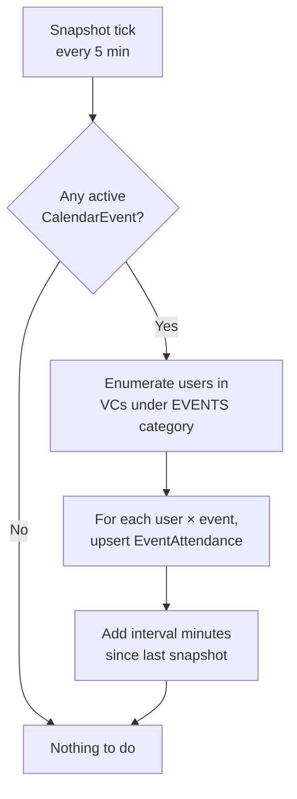

# Event Attendance

`EventAttendanceSnapshotService` samples voice presence in the EVENTS category at a regular cadence and accumulates per-user minutes against each `CalendarEvent`. Those minutes feed into [Auto-Promotion](auto-promotion.md) and `/attendance`.

## Why snapshots, not session math

Attendance was originally derived from `VoiceSession` rows. That works when the event VC is fixed, but breaks the moment a temporary event VC is created and deleted before the bot can read its category. Snapshots solve this by sampling presence while the event is live: even if the channel is gone an hour later, the attendance rows are durable.

## How it works



- Cadence: `EventAttendanceSnapshotIntervalMinutes` (default 5).
- "Active event" = current UTC is within `[StartUtc - buffer, EndUtc + buffer]` where buffer = `AutoPromotionEventBufferMinutes` (default 30).
- "Under EVENTS category" = `VC.CategoryId == EventsCategoryId`. Falls back to `EventsVoiceChannelId` for legacy sessions.
- Per-user upsert keyed by `(CalendarEventId, UserId)`.
- `Username` is captured at first snapshot — historical reads stay correct after display name changes.

## What counts as "qualifying"

For [Auto-Promotion](auto-promotion.md), an `EventAttendance` row counts toward the candidate's event count when:

```
MinutesAttended >= AutoPromotionMinEventAttendanceMinutes (30)
AND CalendarEvent.EndUtc > COALESCE(SeedAppliedAt, RankHistory.AssignedAt)
```

The 30-minute floor prevents drive-by appearances from counting as full attendance.

## Sources

`AttendanceCountingSources` (config, default `Clan`) restricts which event sources count. Currently the only source is `Clan` (events from the clan's Apollo bot). The mechanism exists for future expansion (cross-clan or external events).

## Ad-hoc adjustments

`/add-event-credit <user> <count>` and `/remove-event-credit <user> <count>` (MAJ+) adjust event credit when something happened off-platform or the bot couldn't observe presence (Discord status broken, custom integration missed, etc.).

These adjust `RankHistory.EventsAttendedAtRankBeforeBot` directly — they bump the seed rather than synthesize `EventAttendance` rows. This keeps `EventAttendance` as a pure record of observed voice presence.

## Querying attendance

Most recent attendance for one event:

```sql
SELECT ea.Username, ea.MinutesAttended, ea.LastSnapshotAt
FROM EventAttendance ea
JOIN CalendarEvent ce ON ce.Id = ea.CalendarEventId
WHERE ce.Title = 'Comp Practice'
  AND ce.StartUtc > datetime('now', '-7 days')
ORDER BY ea.MinutesAttended DESC;
```

Total qualifying events at current rank for one user:

```sql
SELECT COUNT(*) AS qualifying_events
FROM EventAttendance ea
JOIN CalendarEvent ce ON ce.Id = ea.CalendarEventId
JOIN RankHistory rh ON rh.UserId = ea.UserId
WHERE ea.UserId = <user-id>
  AND ea.MinutesAttended >= 30
  AND ce.EndUtc > COALESCE(rh.SeedAppliedAt, rh.AssignedAt);
```

## Common operational questions

??? question "User says they were at the event but the bot says they weren't."
    Check:

    1. Were they in a VC **under the EVENTS category** (not just any VC)?
    2. Was the `CalendarEvent` actually live when they were in voice? Check `StartUtc` and `EndUtc` against the `VoiceSession` window.
    3. Did the bot restart during the event? Snapshots resume on restart but minutes during downtime are lost.
    4. Did they meet the 30-minute floor?

    If everything checks out and they're still uncredited, use `/add-event-credit` to correct.

??? question "Why does `VoiceSession` show them in voice but `EventAttendance` doesn't?"
    `EventAttendance` only updates while a `CalendarEvent` is active *and* the user is in a VC under the EVENTS category. `VoiceSession` records every voice join regardless. The two tables are not synchronized.
