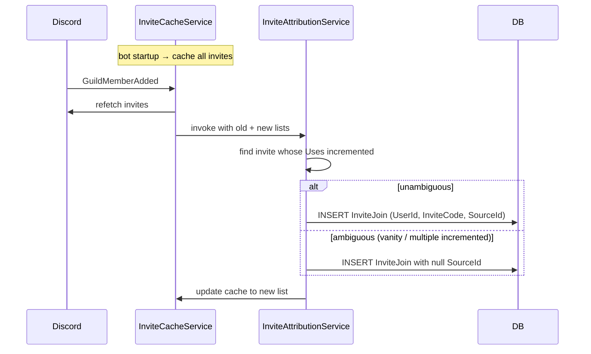

# Invites & Attribution

Tracks which invite link a member used to join, attributing joins to named "invite sources" (e.g. "Reddit Battlefield6", "Direct from MAJ Klaver"). Powers the invite analytics in the [Weekly Briefing](weekly-briefing.md) and the `/invite` command group.

## How Discord makes this hard

Discord's gateway notifies the bot when a member joins, but **doesn't say which invite they used**. The standard workaround is:

1. Cache the invite list and each invite's use count.
2. When a member joins, refetch invites and diff: whichever invite's use count went up by 1 is the one the new member used.
3. Some invites are vanity, single-use, or expired — the diff isn't always unambiguous, so handle ambiguity gracefully.

## Components

| File | Role |
|---|---|
| `InviteCacheService.cs` | Background service that maintains the cached invite list per guild. Refetches on bot startup and after every join. |
| `InviteAttributionService.cs` | Resolves the diff: figures out which cached invite was used and writes an `InviteJoin` row. |
| `InviteSource.cs` (entity) | A named bucket: invite code → human-readable label. |
| `InviteJoin.cs` (entity) | One row per join, attributing the new member to an `InviteSource`. |
| `InviteCommandHandler.cs` | `/invite` command group. |

## Pipeline

## /invite commands

See [Slash Commands](commands.md#invite). Highlights:

- `/invite create <source>` — generates a fresh invite and assigns it to a named `InviteSource`.
- `/invite assign <code> <source>` — retroactively label an existing invite.
- `/invite stats` — counts per source over the last N days.
- `/invite recent` — most recent attributed joins.

## Source naming

`InviteSource.Name` is freeform but should be consistent. Examples used in practice:

- `Reddit Battlefield6` (an invite advertised in r/Battlefield6)
- `Reddit ClanRecruitment`
- `Direct from MAJ Klaver` (a personal invite sent over DM)
- `Discord server listing`

Briefings and analytics group by exact name match, so consistency matters.

## When attribution fails

The most common failure cases:

| Scenario | Result |
|---|---|
| Vanity URL used | Ambiguous; the vanity invite has its own slot in the cache, but Discord's API quirks can leave the diff unclear |
| Member used an invite created before the bot's cache existed | Best-effort attribution if the invite is now in the cache, otherwise null |
| Bot was restarting at the moment of join | The cache refresh after `GuildMemberAdded` may miss the actual increment if Discord rate-limits the refetch |
| Single-use invite | Works fine — the invite disappears after use, but the diff still reveals which code was consumed |

Joins with null `SourceId` are still recorded in `InviteJoin` and can be retroactively attributed if you can identify the actual source by hand.

## Common operational questions

??? question "All recent joins are attributed to one wrong source."
    Most likely the cache is stale or out of sync. Restart the bot to force a fresh refetch. If the issue persists, check `InviteCacheService` logs for refetch failures.

??? question "A specific invite never gets attributed."
    Run `/invite list` to confirm the invite is in the cache and has an `InviteSource`. If not, `/invite assign <code> <source>` will retroactively associate it.

??? question "Want to retire an old source."
    Don't delete the `InviteSource` row — historical `InviteJoin` rows reference it. Instead, delete the underlying Discord invite (so no new joins attribute to it) and leave the `InviteSource` for historical analytics.
