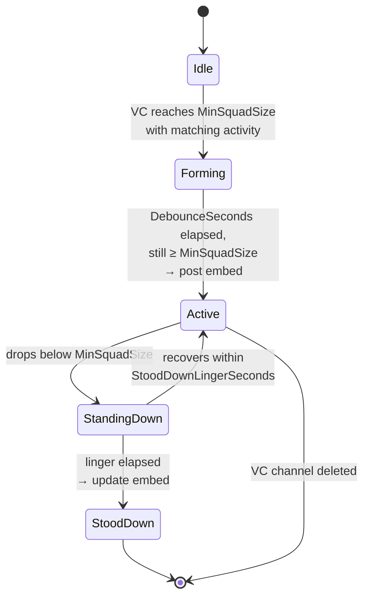

# Patrol Watch

Detects when a squad has formed in an LFG voice channel and posts an alert to a designated channel — pulling clan members in from elsewhere when a real game is starting.

## Trigger logic

A "patrol" is detected when:

- ≥ `MinSquadSize` (default 3) clan members are in the same VC
- The VC is **not** in `ExcludedCategoryIds` (e.g. EVENTS) or `ExcludedChannelIds`
- A majority of those members have a Discord activity matching one of `MatchedGames` (by activity name substring)

When this state holds for `DebounceSeconds` (default 12) — i.e. the squad isn't churning rapidly — Patrol Watch posts an embed to `LfgChannelId`.

When the squad falls below `MinSquadSize` and stays there for `StoodDownLingerSeconds` (default 60), the alert is marked stood down (the original embed is updated rather than replaced).



## Components

| File | Role |
|---|---|
| `PatrolWatchService.cs` | Background service. Maintains state per VC, evaluates transitions on voice/presence events. |
| `PatrolWatchOptions.cs` | Strongly-typed config bound from the `PatrolWatch` section. |
| `PatrolWatchCommandHandler.cs` | `/patrol` slash commands. |
| `PatrolWatchOptOut.cs` | Per-user opt-out persisted to DB. |
| `PatrolWatchServiceCollectionExtensions.cs` | DI wiring. |

## Game matching

Each entry in `MatchedGames` declares:

```json
{
  "DisplayName": "Battlefield 6",
  "ActivitySubstrings": ["Battlefield 6", "Battlefield™ 6"],
  "AccentColor": "#C9A647",
  "ThumbnailUrl": "https://..."
}
```

A user's Discord rich-presence activity name is checked against each substring (case-insensitive, contains-match). The first matching `MatchedGames` entry wins and supplies the embed's accent color and thumbnail.

!!! note "Why substrings"
    Game launchers post slightly different activity names — the trademarked symbol (`™`) appears or doesn't depending on whether the user is on Steam, EA App, console, etc. Matching multiple substrings per game catches all the variants.

## Embed

The alert posts an embed with:

- Game thumbnail and accent color
- VC name (clickable jump link)
- Squad members (display names)
- Game being played
- Squad size

When the squad stands down, the same embed is edited in place to reflect the final state. Discord notifies anyone with the message route bookmarked.

## Opt-out

Members can run `/patrol off` to be excluded from squad detection — they won't be counted toward `MinSquadSize` and won't be named in the embed. `/patrol on` re-enables. `/patrol info` shows current state.

Opt-outs are per-user and persisted in `PatrolWatchOptOut`.

## Exclusions

`ExcludedCategoryIds` and `ExcludedChannelIds` keep specific channels off the alert path. The default config excludes the EVENTS category (events have their own announcements) and a handful of role/admin channels.

## Tuning notes

`DebounceSeconds = 12` is short enough to feel responsive but long enough to absorb the typical "everyone joins within 10 seconds of a notification" churn.

`StoodDownLingerSeconds = 60` prevents brief drops (one person reconnecting) from posting "stood down" prematurely.

If alerts feel spammy in practice, raising `MinSquadSize` to 4 is the gentlest fix. Raising `DebounceSeconds` is also reasonable but makes alerts feel laggy.

## Common operational questions

??? question "Squad formed but no alert."
    1. Were enough members **with matching activity** in the VC? Bot watches activity, not just presence.
    2. Is the channel or its category in the excluded lists?
    3. Did anyone in the squad opt out via `/patrol off`?
    4. Was the squad stable for ≥ `DebounceSeconds`?

??? question "Alert says wrong game."
    Two possibilities. The first matching entry in `MatchedGames` wins, so a more specific game listed below a broader one will lose. Reorder `MatchedGames` so specific entries come first. Or, the user's activity substring isn't yet listed — add it.

??? question "Alert never says 'stood down'."
    The standdown only fires once the squad drops below `MinSquadSize` and stays there for `StoodDownLingerSeconds`. If the channel is deleted (temporary VC) before that, the alert is left as-is. This is intentional — temporary VCs that vanish probably mean the squad moved elsewhere.
