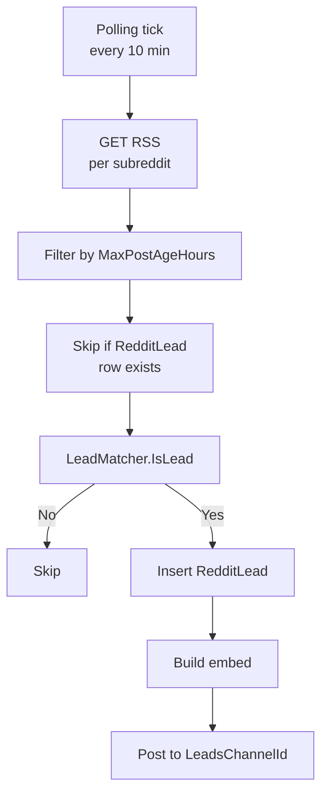

# Reddit Leads

Polls a curated list of subreddits for posts that look like recruitment leads — players asking to join a clan, looking for a squad, or otherwise potential 189th candidates. Matched posts are posted to a leads channel as embeds with action buttons.

## Components

| File | Role |
|---|---|
| `RedditLeadService.cs` | Background polling loop. Pulls RSS, deduplicates, applies matcher, posts. |
| `RedditRssClient.cs` | HTTP client. Sets the User-Agent header (Reddit requires this). |
| `LeadMatcher.cs` | Heuristics. Decides whether a post is a recruitment lead. |
| `RedditLeadEmbedBuilder.cs` | Renders the lead as a Discord embed with buttons. |
| `RedditLeadButtonHandler.cs` | Handles button presses (claim, dismiss, edit notes). |
| `RedditLead.cs` (entity) | Persisted lead record. |
| `RedditLeadsCommandHandler.cs` | `/leads` slash commands. |
| `RedditLeadsOptions.cs` | Strongly-typed `RedditLeads` config section. |

## Pipeline



## Polling

Driven by `PollingIntervalMinutes` (default 10). The service iterates `Subreddits` (comma-separated list in config) and fetches each subreddit's `/.rss` feed.

!!! warning "User-Agent is required"
    Reddit rejects requests with a generic User-Agent. The `UserAgent` config value must be unique and descriptive. Default: `ClanGuard/1.0 by xAP3XRONINx`. If you fork/redeploy, change the `by <reddit-username>` part to your own.

`MaxPostAgeHours` (default 24) caps how far back the service looks. A new deploy that suddenly starts polling won't flood the channel with 30 days of historical hits.

## Subreddits

Default list (see `appsettings.json`):

```
Battlefield, Battlefield6, FindAClan, BattlefieldPortal,
MarathonTheGame, Marathon, okbuddyrunners, lowsodiummarathon,
PS5LFG, XboxLFG, PCGameLFG, gamerlfg,
LookingForGroup, GamerPals,
HellLetLooseLFG, HelldiversLFG, helldivers2,
ArcRaidersLFG, ClanRecruitment, RecruitLTG, TacticalShooters
```

Add or remove via the `Subreddits` config string (comma-separated, no `r/` prefix).

## Matcher heuristics

`LeadMatcher.IsLead` runs a series of cheap checks against the post title and body. Generally:

- Recruitment-style keywords ("looking for clan", "lfg", "join", platform mentions, etc.)
- Negative filters (clearly off-topic, recruiting *for* a clan rather than *for themselves*, etc.)
- Subreddit-specific tweaks (a post in `r/ClanRecruitment` has different signals than one in `r/Battlefield`)

The exact rules live in code and have been tuned against actual results — best to read `LeadMatcher.cs` for the source of truth.

False positives are expected. The embed has a "dismiss" button so leads can be manually rejected; the dismissal is recorded but doesn't currently train the matcher.

## Embed

```
┌──────────────────────────────────────────┐
│ [subreddit] Title goes here              │
│ ──────                                    │
│ Snippet of post body, truncated.         │
│                                           │
│ Posted by /u/username • 3h ago           │
│ [Open on Reddit] [Claim] [Dismiss] [Notes]│
└──────────────────────────────────────────┘
```

Buttons map to `RedditLeadButtonHandler`:

- **Open on Reddit** — link to the post (no interaction)
- **Claim** — assigns the lead to the clicker; visible in `/leads stats`
- **Dismiss** — marks as not-a-lead
- **Edit notes** — opens a modal for free-form notes

## /leads commands

`/leads list` / `/leads recent` / `/leads filter` / `/leads stats` / `/leads edit-notes` — see [Slash Commands](commands.md#leads).

## Data retention

`RedditLead` rows are kept indefinitely. There's no auto-prune today; if the table grows too large, add a cleanup task that drops rows older than N months.

## Common operational questions

??? question "No leads in days."
    1. Check logs for `RedditLeadService` — any 403s, 429s, or RSS parse errors?
    2. Try one of the subreddits manually: `curl -A "ClanGuard/1.0 by xAP3XRONINx" https://www.reddit.com/r/Battlefield/.rss` — confirm Reddit is responding.
    3. Confirm `Enabled` is `true` and `LeadsChannelId` is correct.
    4. The matcher might just be filtering out everything. Check `RedditLead` table — are any rows being created (matched=false rows aren't persisted, but the log will show evaluations)?

??? question "Same post posted twice."
    Deduplication is keyed by Reddit post ID (`t3_xxxxxx`). If duplicates appear, two things to check:

    1. Did the post ID change? (Crossposts share titles but have different IDs.)
    2. Did the DB get reset? Without prior `RedditLead` rows, dedup can't recognize old posts as already-seen.

??? question "Want to add a new subreddit."
    Append to `Subreddits` and redeploy. No other code changes needed; the matcher is generic.
