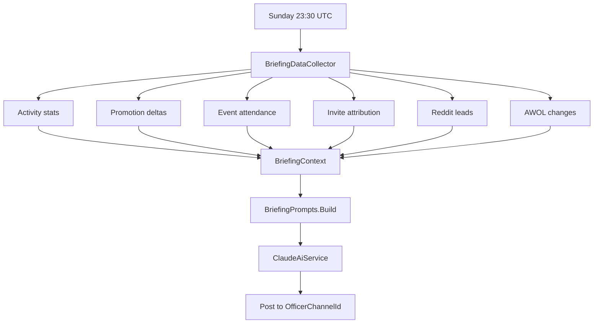

# Weekly Officer Briefing

Every Sunday at 23:30 UTC, an AI-generated briefing is posted to the officer channel summarizing the week's clan activity. The briefing is composed by Anthropic's Claude API from a structured snapshot of the bot's data.

## Components

| File | Role |
|---|---|
| `Briefing/WeeklyOfficerBriefingService.cs` | Background service. Runs the schedule. |
| `Briefing/BriefingDataCollector.cs` | Pulls structured stats from the DB and external sources. |
| `Briefing/BriefingContext.cs` | The shape of data fed into the prompt. |
| `Briefing/BriefingPrompts.cs` | The prompt templates. |
| `Briefing/BriefingInviteSection.cs` | Renders invite-attribution data into prompt input. |
| `Briefing/BriefingRedditLeadsSection.cs` | Renders Reddit leads into prompt input. |
| `Briefing/BriefingServiceCollectionExtensions.cs` | DI wiring. |
| `AI/ClaudeAiService.cs` | Anthropic API client. |
| `BriefingNowCommandHandler.cs` | `/briefing-now` slash command (BG+). |

## Schedule

Configured via the `WeeklyBriefing` section:

| Key | Default |
|---|---|
| `RunOnDayUtc` | `Sunday` |
| `RunAtUtc` | `23:30` |
| `OfficerChannelId` | `1499843996032438272` |
| `DryRun` | `false` |
| `MaxOutputTokens` | `1500` |

The service polls once a minute and fires when the configured day-of-week and time are met.

## Pipeline

## What goes in

`BriefingDataCollector` pulls a one-week window of:

- **Activity** — total messages, voice hours, top participants
- **Promotions** — who advanced, who's now eligible
- **Events** — number of events, average attendance, no-shows
- **AWOL** — newly flagged, kicked, recovered
- **Invites** — new joins per attributed source
- **Reddit leads** — count, claimed/dismissed split

The exact shape lives in `BriefingContext`. To add a new section: add a property to `BriefingContext`, populate it in `BriefingDataCollector`, and reference it in `BriefingPrompts`.

## Prompt structure

`BriefingPrompts` builds a system prompt that instructs the model to act as an officer's chief of staff producing a concise weekly summary. Each `BriefingContext` section is rendered into the prompt as structured data (lists, tables) so the model has clean input to cite.

The model is instructed to:

- Lead with what changed week-over-week
- Call out anomalies (sudden drop in activity, unusual recruitment patterns, etc.)
- Surface members worth recognizing (top contributors, recent promotions)
- End with action items for the officer corps

Output is capped at `MaxOutputTokens` (default 1500) — long enough for substantive analysis, short enough to fit in a Discord message without splitting.

## Triggering manually

`/briefing-now` (`BriefingNowMinRank`, default BG) bypasses the schedule. Useful when:

- Testing prompt changes
- Generating an off-cycle briefing for a leadership meeting

## Dry run

`WeeklyBriefing.DryRun = true` runs the full pipeline (data collection, model call, billed tokens) but doesn't post the result. The output appears in the bot logs at `Information` level, prefixed `[BRIEFING DRYRUN]` (or similar — check the service for the exact tag).

Use dry-run when iterating on the prompt to avoid spamming the officer channel.

## Cost & rate limits

Each run is roughly one API call to Claude (~5–15K input tokens depending on the week's activity, ≤1.5K output). At Claude Sonnet pricing this is on the order of cents per run.

If briefings stop appearing, check the API key first — expired/rotated keys are the most common cause.

## Common operational questions

??? question "Briefing didn't post Sunday night."
    1. `Claude__ApiKey` set in the environment?
    2. `WeeklyBriefing.OfficerChannelId` correct and bot has post permissions?
    3. `DryRun` not accidentally `true`?
    4. Was the bot online at the scheduled time? Logs around the schedule time will show whether the trigger fired.

??? question "The briefing said something factually wrong."
    The model is summarizing structured data from `BriefingContext` — if the underlying data is correct but the briefing misrepresents it, that's a prompt issue. Adjust `BriefingPrompts` and re-test with `/briefing-now`.

    If the underlying data is wrong, fix the collector (`BriefingDataCollector`) — the model can't be more accurate than its input.

??? question "Want to add a new section."
    1. Add a property to `BriefingContext`.
    2. Populate it in `BriefingDataCollector`.
    3. Render it as a section in `BriefingPrompts`.
    4. Test with `/briefing-now` before next Sunday.
