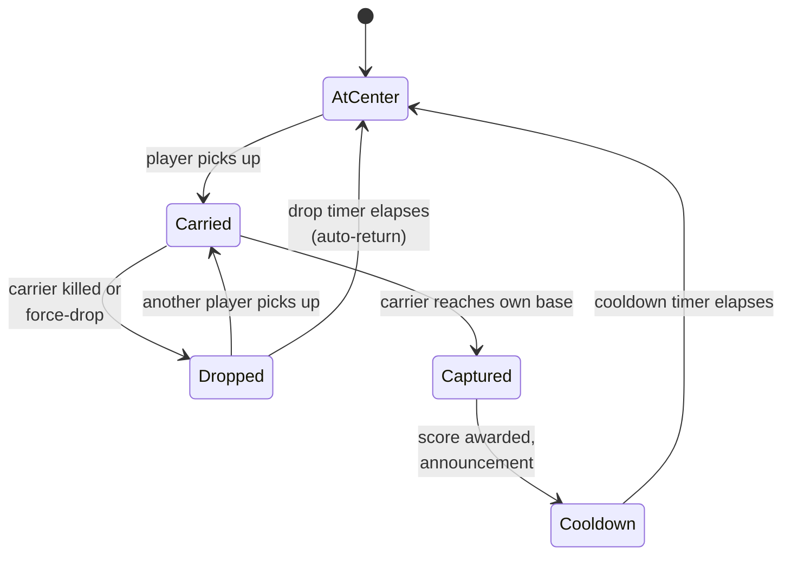

# Design

Single-flag CTF: one neutral flag at center; either team can pick it up; carrier returns it to their own base for a capture. After a capture, a cooldown holds the flag at base before it respawns at center.

## Flag state machine

### State details

| State | Behavior |
|---|---|
| `AtCenter` | Flag idle at the map center. Visible on minimap via the buried CapturePoint marker. Either team can pick up. |
| `Carried` | A player is holding the flag. Their position is marked. |
| `Dropped` | Flag was dropped on death or force-drop. Auto-returns to center after a timer if not picked up. |
| `Captured` | Flag was returned to a team's base. Score awarded; in-world flag returns to a fixed location at the capturing team's base. |
| `Cooldown` | Brief pause after capture so the round doesn't immediately start a new run. |

## Capture flow

1. Player on Team A picks up the flag at center.
2. Their position is announced ("Player picked up the flag").
3. They run to Team A's base.
4. On reaching the capture trigger at base → score for Team A.
5. Capture announcement names the player ("Player captured the flag for Team A!").
6. State → `Cooldown`. Flag visually rests at Team A's base.
7. Cooldown elapses → state → `AtCenter`. Flag respawns at the map's centerpoint.

## Player name announcements

Added in versions 4.5.9 through 4.5.11. The announcement system uses the player's display name in the in-world chat / banner notifications:

- Pickup: "*PlayerName* picked up the flag"
- Drop: "*PlayerName* dropped the flag"
- Capture: "*PlayerName* captured the flag for *Team*"

These names come from the standard player object — no manual lookup is needed against an external data source.

## Drop position fix

Earlier builds had a bug where the dropped flag would spawn at an incorrect position (often falling through the world or appearing inside geometry). The fix uses the carrier's last-known **valid** ground position rather than their literal Position at moment of death — death animations and ragdolls move the player object out of the navigable space.

## Buried CapturePoint minimap marker

!!! tip "Discovered via Mike on the BFPortal Discord"
    Getting the flag's location to show up as a marker on the minimap *without* using a true CapturePoint object is non-obvious. The trick: spawn a `CapturePoint` underground (Y far below the map floor) with no actual capture mechanics wired up. The Portal runtime renders the minimap marker based on the CapturePoint's existence, but since it's buried underground, players never interact with it.

    The actual gameplay capture trigger is a separate `AreaTrigger` at the real flag location.

This is a workaround — Portal doesn't expose a "minimap marker, please" primitive. The buried CapturePoint is the cleanest way to get the visual without the gameplay implications.

## Scoring

| Event | Score |
|---|---|
| Successful capture | +1 to capturing team |
| Per-player capture credit | +N to capturing player on the scoreboard |
| Per-player flag-carry time | optional column on scoreboard (TODO: confirm) |

Win condition: first team to N captures, or capture lead at match timer expiry.

## Per-player scoreboard

CTF uses a custom scoreboard via `SetScoreboardPlayerValues`. Same 6-column hard cap as Vendetta — see [Portal Scripting Gotchas](../../portal-scripting/gotchas.md#setscoreboardplayervalues-hard-caps-at-6-arguments).

Current columns _(verify against current build)_:

| # | Column |
|---|---|
| 1 | Captures |
| 2 | Returns |
| 3 | Kills |
| 4 | _TODO_ |
| 5 | _TODO_ |
| 6 | _TODO_ |

## Clan info embed

Round preamble shows a banner with:

- 189th name / branding
- Discord invite URL
- Brief mode description

This is rendered as an in-world UI panel during the pre-round phase. The Discord invite URL is hardcoded in the script (rotate manually when invites are regenerated).

## Spawn protection

After respawn, players have a brief invulnerability window. Earlier builds used `AreaTrigger`-based spawn protection (a trigger volume around each spawn point), but `AreaTrigger` reliability on PS5 turned out to be inconsistent — see [Portal Scripting Gotchas](../../portal-scripting/gotchas.md#areatrigger-reliability-on-ps5). Current builds use an AABB (axis-aligned bounding box) check against player position in script, evaluated each tick.

## Vehicle handling

Earlier builds had a bug where vehicle seat events spammed errors to the console. Fixed by guarding the seat-event handler against null/undefined seat indices that the runtime occasionally emits. See [API Quirks](../../portal-scripting/api-quirks.md).

## Map-specific notes

| Map | Notes |
|---|---|
| `MP_Abbasid` | First map shipped. Used as reference for layout conventions. |
| `MP_Hagental` | TODO |
| `MP_Outskirts` | TODO |
| `MP_Subsurface` | TODO |

Each map's spatial JSON lives in the repo under a per-map folder. The TypeScript loader reads the active map's JSON at runtime and configures the mode accordingly.
