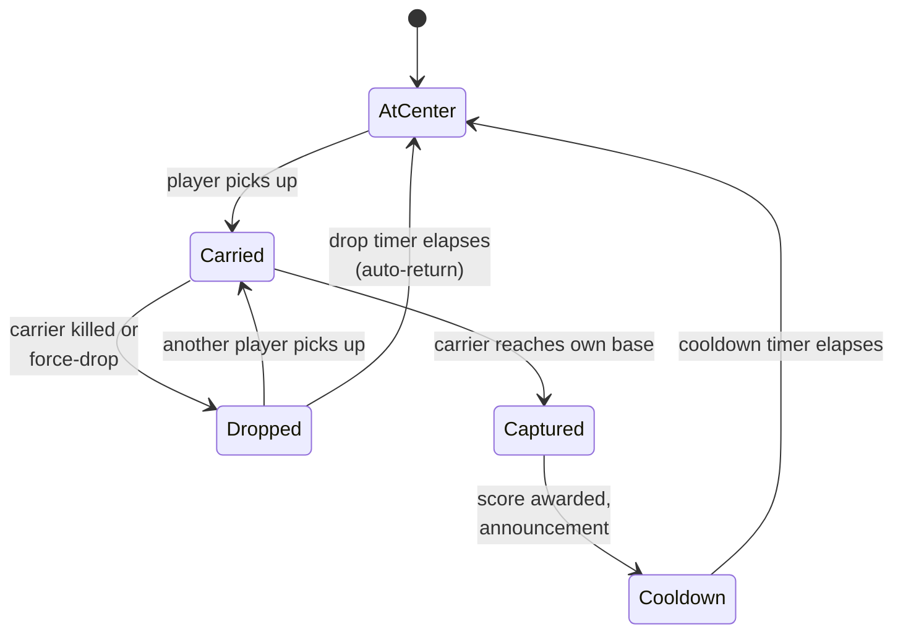

# Design

Single-flag CTF: one neutral flag at center; either team can pick it up; carrier returns it to their own base for a capture. After a capture, a cooldown holds the flag at base before it respawns at center.

## Flag state machine



### State details

| State | Behavior |
|---|---|
| `AtCenter` | Flag idle at the map center. Visible on minimap via the buried CapturePoint marker. Either team can pick up. |
| `Carried` | A player is holding the flag. Their position is marked. |
| `Dropped` | Flag was dropped on death or force-drop. Auto-returns to center after a timer if not picked up. |
| `Captured` | Flag was returned to a team's base. Score awarded; in-world flag returns to a fixed location at the capturing team's base. |
| `Cooldown` | Brief pause after capture so the round doesn't immediately start a new run. |

## Capture flow

1. Player on Team A picks up the flag at center.
2. Their position is announced ("Player picked up the flag").
3. They run to Team A's base.
4. On reaching the capture trigger at base → score for Team A.
5. Capture announcement names the player ("Player captured the flag for Team A!").
6. State → `Cooldown`. Flag visually rests at Team A's base.
7. Cooldown elapses → state → `AtCenter`. Flag respawns at the map's centerpoint.

## Player name announcements

Added in versions 4.5.9 through 4.5.11. The announcement system uses the player's display name in the in-world chat / banner notifications:

- Pickup: "*PlayerName* picked up the flag"
- Drop: "*PlayerName* dropped the flag"
- Capture: "*PlayerName* captured the flag for *Team*"

These names come from the standard player object — no manual lookup is needed against an external data source.

## Drop position fix

Earlier builds had a bug where the dropped flag would spawn at an incorrect position (often falling through the world or appearing inside geometry). The fix uses the carrier's last-known **valid** ground position rather than their literal Position at moment of death — death animations and ragdolls move the player object out of the navigable space.

## Buried CapturePoint minimap marker

!!! tip "Discovered via Mike on the BFPortal Discord"
    Getting the flag's location to show up as a marker on the minimap *without* using a true CapturePoint object is non-obvious. The trick: spawn a `CapturePoint` underground (Y far below the map floor) with no actual capture mechanics wired up. The Portal runtime renders the minimap marker based on the CapturePoint's existence, but since it's buried underground, players never interact with it.

    The actual gameplay capture trigger is a separate `AreaTrigger` at the real flag location.

This is a workaround — Portal doesn't expose a "minimap marker, please" primitive. The buried CapturePoint is the cleanest way to get the visual without the gameplay implications.

## Scoring

| Event | Effect |
|---|---|
| Successful capture | +1 to capturing team's score |
| Successful capture | +1 to capturing player's `captures` |
| Kill while not carrying or having recently carried | +1 to killer's `kills` |
| Death | +1 to victim's `deaths` |

Earlier builds tracked `flag_carrier_kills` separately (kills made *against* a flag carrier or *by* a flag carrier). That field was merged into the regular `kills` counter when the scoreboard was simplified to fit under the 6-argument cap — see [Per-player scoreboard](#per-player-scoreboard) below.

Win condition: first team to N captures, or capture lead at match timer expiry.

## Carrier rules

Carrying the flag comes with significant restrictions. These are enforced in script, not via Portal Builder modifiers:

- **Melee only** — the carrier is forced to the sledgehammer. No firearms, no gadgets. Swing or die.
- **Drop on weapon switch** — attempting to switch back to a primary drops the flag immediately.
- **Vehicle passenger only** — a flag carrier entering a vehicle is forced into a passenger seat. No solo flag runs in a tank.
- **Globally marked** — colored smoke trails the carrier; they're spotted on the minimap for everyone; a flag icon floats above their head.

These rules turn flag runs into team plays — the carrier needs cover, transport, and route-calling from squadmates because they can't fight back effectively on their own.

## Drop and return

When a carrier dies or voluntarily drops:

1. The flag is **thrown** along a projectile arc based on the carrier's look direction and movement velocity at the moment of drop. It's not just placed at their feet.
2. Full collision detection against walls and terrain — the flag lands where physics says.
3. A **5-second pickup delay** holds the flag in place after a drop. During this delay, smoke is hidden and the world icon shows "UNLOCKING" (matching the post-capture cooldown UX).
4. Teammates can **return** a dropped friendly flag by interacting with it; enemies can pick it up after the delay.
5. If nobody touches the dropped flag for 30 seconds, it **auto-returns** to its home position.

## Post-capture cooldown

After a successful capture, the flag respawns at home but enters a **15-second locked cooldown** before it can be picked up again. During the cooldown:

- Smoke is suppressed (so smoke-on continues to be a reliable "flag is grabbable" signal)
- The world icon label shows "UNLOCKING"
- After 15 seconds the smoke and "CAPTURE" label are restored

This gives both teams a reset window after each score — preventing a single dominant carrier from chaining captures with no breathing room for the defending team.

## HUD elements

A custom HUD sits at the top of the screen:

- **Team scores** with bracket indicators highlighting the leading team
- **Round timer** counting down minutes:seconds
- **Flag progress bar** — real-time indicator showing how far each flag has moved from its home base toward the enemy capture zone, with smooth animated icons
- **Team orders bar** — context-aware updates ("Friendly flag taken", "Enemy flag dropped", "Enemy flag captured") so players always know the current flag state

## Voice callouts

In-game VO announcements fire on:

- Flag taken
- Flag returned (manually or auto)
- Flag captured

These reuse BF6's built-in objective announcer voice lines.

## Auto team balance

Teams are automatically rebalanced if one side gains too large an advantage. The most recently joined player on the larger team is moved after a countdown warning (giving them a moment to react).

## Multi-team support

The script supports up to 7 teams for larger CTF variants, with per-team flag colors, capture zones, and scoring. The standard 189th deployment is 2-team, but the multi-team scoreboard layout exists in code (4 columns: Team / Captures / Kills / Deaths).

## Per-player scoreboard

CTF uses a custom scoreboard via `SetScoreboardPlayerValues`. The same 6-argument hard cap applies — see [Portal Scripting Gotchas](../../portal-scripting/gotchas.md#setscoreboardplayervalues-hard-caps-at-6-arguments). With the player handle taking the first slot, that leaves 5 data columns.

History is worth noting: an earlier build attempted `Captures / Kills / Deaths / Assists / Carrier Kills` (5 data columns), which was technically at the cap but caused trailing-zero columns to render in unfilled multi-team variants. Subsequent builds dropped down to 3 columns and merged Carrier Kills into Kills:

| # | Column | Source field on `PlayerScore` |
|---|---|---|
| 1 | **Captures** | `captures` |
| 2 | **Kills** | `kills` (carrier kills no longer separated; all kills go here) |
| 3 | **Deaths** | `deaths` |

The 3-team and FFA variants use a 4-column layout, prepending a Team column:

| # | Column |
|---|---|
| 1 | Team |
| 2 | Captures |
| 3 | Kills |
| 4 | Deaths |

`Assists` and `Carrier Kills` were dropped to stay safely under the cap. If you need to reintroduce one, drop another to keep the data-column count at 3 (2-team) or 4 (multi-team).

### String keys

```json
"scoreboard_captures_label":        "Captures",
"scoreboard_kills_label":           "Kills",
"scoreboard_deaths_label":          "Deaths",
"scoreboard_capture_assists_label": "Assists",       // unused in current build
"scoreboard_carrier_kills_label":   "Carrier Kills"  // unused in current build
```

The latter two keys remain in `strings.json` for ease of reintroduction.

## Clan info embed

Round preamble shows a banner with:

- 189th name / branding
- Discord invite URL
- Brief mode description

This is rendered as an in-world UI panel during the pre-round phase. The Discord invite URL is hardcoded in the script (rotate manually when invites are regenerated).

## Spawn protection

After respawn, players have a brief invulnerability window. Earlier builds used `AreaTrigger`-based spawn protection (a trigger volume around each spawn point), but `AreaTrigger` reliability on PS5 turned out to be inconsistent — see [Portal Scripting Gotchas](../../portal-scripting/gotchas.md#areatrigger-reliability-on-ps5). Current builds use an AABB (axis-aligned bounding box) check against player position in script, evaluated each tick.

## Vehicle handling

Earlier builds had a bug where vehicle seat events spammed errors to the console. Fixed by guarding the seat-event handler against null/undefined seat indices that the runtime occasionally emits. See [API Quirks](../../portal-scripting/api-quirks.md).

## Map-specific notes

| Map | Notes |
|---|---|
| `MP_Abbasid` | First map shipped. Used as reference for layout conventions. |
| `MP_Hagental` | The canonical "working reference" build. When a new map breaks, the standard fix is to diff its spatial JSON against Hagental's — they should be structurally identical. |
| `MP_Outskirts` | Asymmetric map; the hardest to balance. After multiple iterations the flag sits at approximately `X=-30, Z=-98` with adjusted HQ Forward spawn positions. Final imbalance: ~3% on opening rush, ~13% on HQ Forward rush — near the practical balance ceiling given the map's geometry. Known landmine: an early build's spatial JSON used `Laptop_01` for the team-switch station prop instead of `ComputerMonitor_01`, which silently broke station rendering. Always verify ObjId 503/504 are `ComputerMonitor_01`. |
| `MP_Subsurface` | Working reference, structurally identical to Hagental's spatial JSON. |

Each map's spatial JSON lives in the repo under a per-map folder. The TypeScript loader reads the active map's JSON at runtime and configures the mode accordingly.

### Diffing a broken map against a known-good one

The fastest way to debug a new map is to diff its spatial JSON against a working reference (typically Hagental or Subsurface):

```bash
python3 -c "
import json
with open('MP_Subsurface_Single_CTF_spatial.json') as f: ref = json.load(f)
with open('MP_NewMap_Single_CTF_spatial.json') as f: new = json.load(f)
# Compare object inventory by ObjId, type, id_path
"
```

In practice the difference is usually one or two object types or names — a renamed prop, a missed ObjId. The structure (object count, ObjId space, hierarchy) should match the reference exactly.
