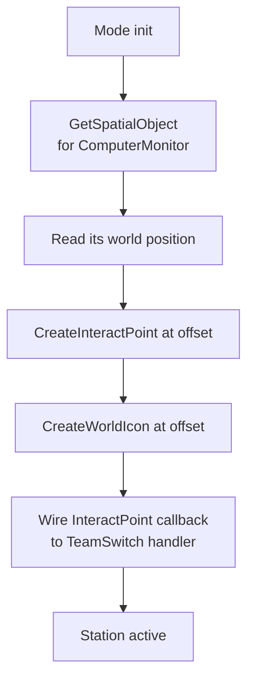

# Team Switch Stations

Each team's base has a `ComputerMonitor` prop that, when interacted with, swaps the player to the other team. This lets players rebalance mid-match without leaving the server.

## Composition

A station is the combination of three runtime entities:

| Entity | Source | Purpose |
|---|---|---|
| `ComputerMonitor` prop | Authored in Godot, exported in spatial JSON | Visible model |
| `InteractPoint` | **Spawned at runtime** | Interaction prompt + trigger callback |
| `WorldIcon` | **Spawned at runtime** | Floating "Switch Teams" label above the monitor |

Authoring the prop in Godot but spawning the InteractPoint/WorldIcon at runtime is intentional — `mod.GetSpatialObject()` can't retrieve positions from `AreaTrigger` or `InteractPoint` node types in the spatial JSON, so we have to spawn those programmatically. See [API Quirks](../../portal-scripting/api-quirks.md#modgetspatialobject).

## Spawn flow



## Position offsets

The `ComputerMonitor` prop has a fixed visual size, but the InteractPoint needs to sit slightly in front of it (so the prompt appears where a player approaches the screen, not inside the desk) and the WorldIcon needs to float above it.

The offsets are computed using **bearing math** from the monitor's facing direction:

- **Forward** offset for the InteractPoint (in front of the screen)
- **Up** offset for the WorldIcon (above the monitor)

```ts
// Sketch (verify against actual implementation)
const monitor = mod.GetSpatialObject("TeamSwitchMonitor_TeamA");
const forward = bearingToVector(monitor.Yaw);      // unit vector
const interactPos = monitor.Position + forward * INTERACT_OFFSET;
const iconPos     = monitor.Position + UP * ICON_OFFSET;

const ip = mod.CreateInteractPoint(interactPos, "Switch Teams");
ip.OnInteract = (player) => switchPlayerTeam(player);

const icon = mod.CreateWorldIcon(iconPos);
SetWorldIconOwner(icon, /* see WorldIcon ordering note */);
SetWorldIconText(icon, "Switch Teams");
```

!!! danger "WorldIcon ordering"
    `SetWorldIconOwner` must be the first call after creating a `WorldIcon`. If you set position/text/color first, the icon won't render correctly. See [Portal Scripting Gotchas](../../portal-scripting/gotchas.md#setworldiconowner-must-come-first).

## Team switch handler

When a player triggers the InteractPoint:

1. Determine current team.
2. Move them to the opposite team via the runtime's team-assignment API.
3. Respawn them at the new team's spawn region (otherwise they end up on the enemy side of the map at their original position).
4. Optional: brief cooldown / spam-protection so a player can't rapid-toggle.

## Per-map placement

Each map's spatial JSON has two named ComputerMonitor objects (one per team's base). The naming convention used in the repo:

```
TeamSwitchMonitor_TeamA
TeamSwitchMonitor_TeamB
```

In Godot you place the prop visually at each base, give it the canonical name, and re-run the spatial-JSON conversion script. See [Godot Workflow](../../portal-scripting/godot-workflow.md).

## Failure modes

| Symptom | Likely cause |
|---|---|
| InteractPoint prompt doesn't appear | `mod.CreateInteractPoint` failed silently; check that monitor position resolved correctly |
| Players can't actually switch | TeamSwitch handler didn't wire to the InteractPoint's callback, or the team-assignment API failed |
| WorldIcon shows but follows the wrong player | `SetWorldIconOwner` was called *after* `SetWorldIconPosition`, or wasn't called at all |
| InteractPoint is inside the desk | Forward offset wrong sign, or bearing computed from world-space yaw vs. local-space yaw mismatch |

## Why not just use Godot AreaTriggers?

Two reasons:

1. `mod.GetSpatialObject()` can't retrieve AreaTrigger or InteractPoint node positions, so authoring them in Godot leaves them unreachable from script.
2. AreaTrigger reliability on PS5 has been inconsistent — see [Portal Scripting Gotchas](../../portal-scripting/gotchas.md#areatrigger-reliability-on-ps5).

Spawning at runtime from a `ComputerMonitor` (which `GetSpatialObject` *does* support) sidesteps both problems.
