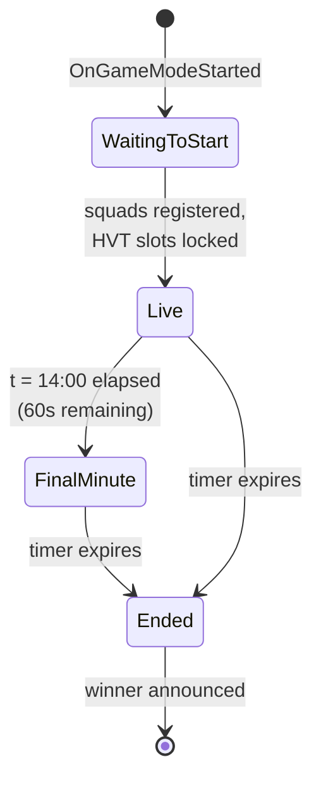
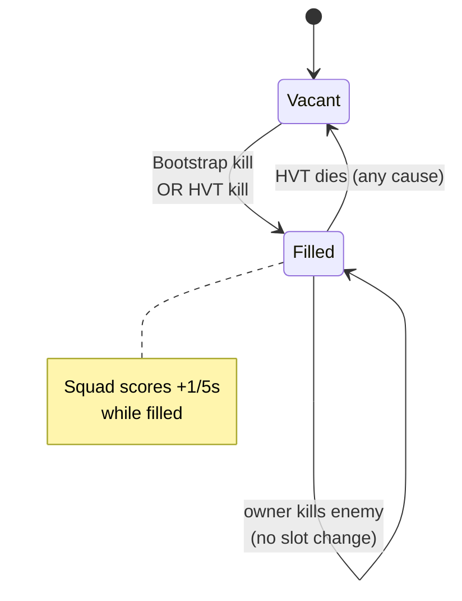
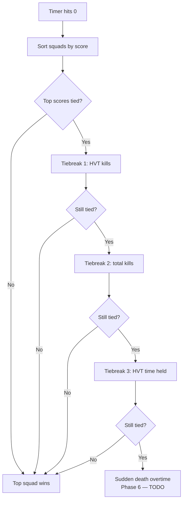

# Design & State Machine

Vendetta is a single 15-minute match with a fixed pool of HVT slots distributed across squads. Slots fill and empty dynamically as kills happen. The match ends when the timer expires; tiebreakers resolve any ties.

## Match-level state



Only three top-level states. There are no rounds, no intermissions, no per-round HVT selection. The dynamics happen *inside* the `Live` state through the squad slot system.

## HVT slot system

Each squad owns at most one HVT slot. The total number of slots is fixed at match start:

```
hvtSlots = max(1, squadCountAtMatchStart - 2)
```

Slots can be in two phases at any moment:

| Phase | Condition | Promotion rule |
|---|---|---|
| **Bootstrap** | `activeHvts < hvtSlots` | Any cross-squad kill by a player whose squad has no current HVT promotes the killer |
| **Locked** | `activeHvts == hvtSlots` | Only HVT-kills promote. HVT-on-HVT clears the victim's slot but never transfers (killer keeps existing status) |

When an HVT dies by non-kill cause (suicide, fall damage, friendly fire), the slot clears and the system drops back into Bootstrap until a kill refills it.



The slot machine is per-squad. Each squad's slot is independent of every other squad's.

## Scoring

All scoring is **per squad**, not per player.

| Event | Base value | Final-minute (×2) |
|---|---|---|
| Standard kill | +1 | +2 |
| HVT kill (victim was an HVT) | +5 | +10 |
| HVT alive tick (every 5s, per live HVT in your squad) | +1 | +2 |
| Recovery bonus (direct chain recovery) | +1 | +2 |

The "final minute" trigger is the moment the match clock reaches 60 seconds remaining. From that point until end-of-match, every score event is doubled. A toast announces the transition once: *"Final minute: scoring is doubled"*.

### Recovery bonus chain

When a squad's HVT is killed and that squad's next kill within a short window promotes a new HVT for them, the promoting kill grants a +1 recovery bonus on top of the standard kill / HVT-kill score. This rewards squads for snapping back from a slot loss instead of leaving it open for the rest of the match.

## End-by-time and tiebreakers

At t=0:00, the match ends and rankings are computed.



The four-stage tiebreaker chain (score → HVT-kills → total-kills → HVT-time-held) resolves nearly every realistic outcome without overtime.

### Sudden death overtime _(deferred — Phase 6)_

When implemented, sudden death overtime fires only for **two-way ties at first place**. Three-way+ ties fall through to a designated tiebreaker (the chain above almost always resolves anyway). During overtime, non-finalist squads enter hard-out spectate — they observe but cannot participate. First kill in overtime wins.

This is not yet implemented in v0.4.0.

## Restrictions

- **No vehicles** — the mode is infantry-only by design. Vehicle restrictions are configured in the Portal Builder, not in script.

## Gamemode dispatch

Vendetta confirms it's the active mode by looking for a `DummySpatialProp` with `ObjId = 40010` in the loaded scene. The dispatch loop checks this on `OnGameModeStarted`; if the prop isn't found, the script is on the wrong map and bails out cleanly rather than running broken logic.

When you author or convert a new map, make sure the spatial JSON includes the dispatch prop, or Vendetta will silently no-op.

## Phase scope summary

| Phase | Scope | Status |
|---|---|---|
| 1 | State machine, scoring, end-by-time, tiebreakers, debug logging | ✅ v0.1.0 |
| 2A | HVT WorldIcon pings (Alert image, head-height) | ✅ v0.2.0 |
| 2B | +25 HP buff via `mod.SetPlayerMaxHealth` | ✅ v0.2.0 |
| 3 | Per-player stat tracking, custom 5-column scoreboard (CustomFFA) | ✅ v0.3.0 |
| 4 | Match-start splash, persistent clan info box, MM:SS round timer (red + pulsing brackets in the final 60s) | ✅ v0.4.0 |
| 5 | HVT identity card on promotion, HVT count indicator, final-minute UI takeover, squad color-coding | _Deferred_ |
| 6 | Sudden death overtime, hard-out spectate | _Deferred_ |
