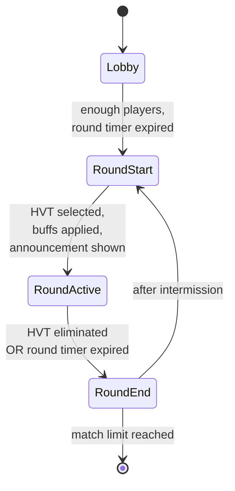

# Design & State Machine

Vendetta runs as a sequence of rounds. Each round selects one HVT, plays out for the round duration, and resolves with either an HVT-killed or HVT-survived outcome.

## State machine

### States

| State | Purpose |
|---|---|
| `Lobby` | Pre-match. Waiting for minimum players. |
| `RoundStart` | Brief setup phase. HVT selected; HP buff applied; ping system armed; UI announces the new HVT. |
| `RoundActive` | Live play. HVT pings on interval; kills resolve scores; round timer counts down. |
| `RoundEnd` | Cooldown / scoreboard display. Resets transient state for the next round. |

State is owned by a single mutable variable, transitioned via an explicit setter that handles entry/exit side effects. Adding a new state means adding to the enum, adding entry/exit handlers, and updating the transition table.

## Round flow

1. **Round start**
    - Pick HVT randomly from active players (excluding the previous round's HVT to avoid streaks).
    - Apply HP buff to the HVT.
    - Spawn ping `WorldIcon` over the HVT's position.
    - Show round-start announcement to all players.
2. **Round active**
    - HVT ping refreshes every N seconds while HVT is alive.
    - Kill events: if victim is the HVT → award bonus, transition to `RoundEnd`. If victim is a normal player → standard score.
    - Round timer ticks down. On expiry without HVT death → HVT survives, transition to `RoundEnd`.
3. **Round end**
    - Display per-player scores via the scoreboard.
    - Brief intermission.
    - Reset HVT references, clear `WorldIcon`, transition to `RoundStart` (or end match if at the limit).

## HVT selection

Players are tracked with a "rounds since last HVT" counter. The selector weights players by that counter so everyone gets a turn before anyone repeats. The previous round's HVT is excluded from the next selection regardless of weights — prevents back-to-back targeting.

If only one player is available (everyone else AFK / disconnected), the round is skipped and the state machine falls back to `Lobby`.

## Scoring

| Event | Points |
|---|---|
| Kill HVT | _TODO — fill in actual value_ |
| Normal kill | _TODO_ |
| Round survived as HVT | _TODO_ |
| Death (any) | 0 (or negative — _TODO_) |

Per-player score is shown in [the scoreboard](scoreboard.md), which has a hard 6-column limit imposed by the `SetScoreboardPlayerValues` API.

## Win conditions

- **First to N kills** _(or whatever Vendetta uses — TODO)_
- **Match timer expiry** triggers final scoreboard regardless.

## Known issues

- **Splash screen indefinite display** — at one point the splash screen wouldn't dismiss reliably on round transition. Verify whether this is still occurring at v0.3.0; if so, document the repro here.
