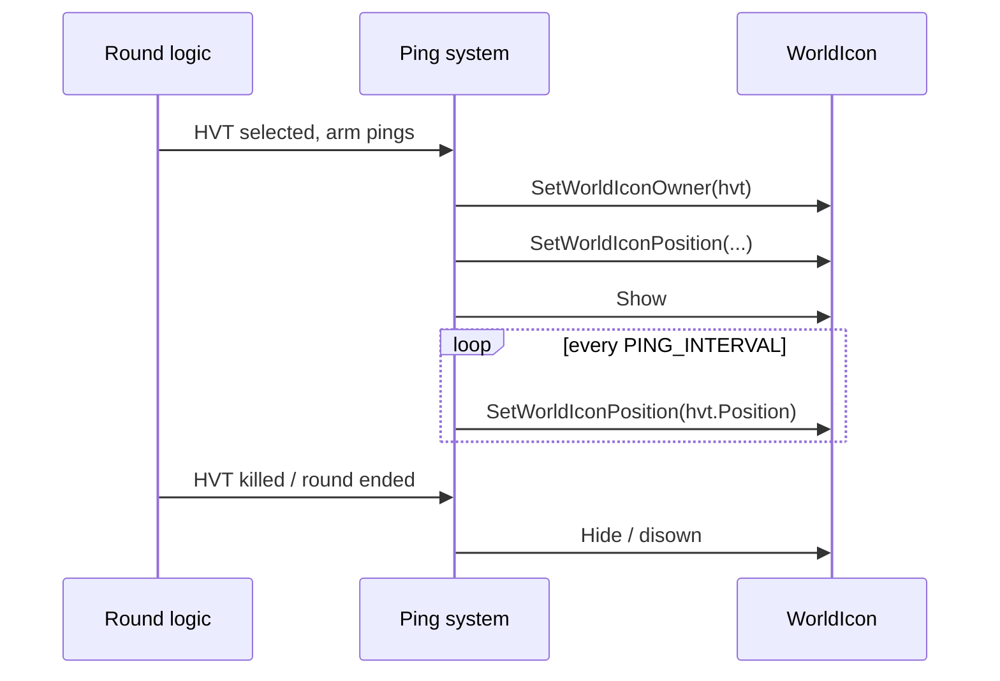

# HVT System

Three subsystems make the HVT viable as a target *and* fair to play:

1. **Selection** — who becomes HVT each round
2. **HP buff** — extra survivability so they're not deleted in 0.4s
3. **Ping system** — visual indicator everyone can see, on a refresh interval

## Selection

See [Design & State Machine § HVT selection](design.md#hvt-selection).

## HP buff

The HVT spawns (or is converted in-place) with elevated maximum health. The buff is applied on round start and stripped on round end — even if the HVT survives, the next round resets everyone to standard HP before re-applying to whoever is selected.

```ts
// Sketch of the buff apply pattern
function applyHvtBuff(hvtPlayer: Player) {
    hvtPlayer.MaxHealth = HVT_MAX_HP;     // TODO: confirm exact API
    hvtPlayer.CurrentHealth = HVT_MAX_HP;
}

function clearHvtBuff(hvtPlayer: Player) {
    hvtPlayer.MaxHealth = STANDARD_MAX_HP;
}
```

!!! note "Buff value tuning"
    The exact multiplier has been tuned across versions. Check the `[changelog](changelog.md)` for current value. Too high and the HVT becomes a sponge that survives every round; too low and HVT gets melted instantly.

## Ping system

Every player can see a marker over the HVT's position. The marker is a `WorldIcon` whose owner is the HVT player; it refreshes every N seconds (the **ping interval**) while the HVT is alive.



### API ordering landmine

!!! danger "SetWorldIconOwner must be called BEFORE other WorldIcon setters"
    The Portal runtime requires `SetWorldIconOwner` to be the first call after creating or repurposing a `WorldIcon`. Calling `SetWorldIconPosition` or any of the other setters first results in the icon attaching to the wrong owner — or worse, no owner at all and the icon orphans.

    The pattern is:

    ```ts
    SetWorldIconOwner(icon, hvtPlayer);   // FIRST
    SetWorldIconPosition(icon, hvtPlayer.Position);
    SetWorldIconText(icon, "HVT");
    SetWorldIconColor(icon, RED);
    ```

    Reordering these is a foot-gun that has bitten this codebase. See [Portal Scripting Gotchas](../../portal-scripting/gotchas.md#setworldiconowner-must-come-first).

## Ping interval

The ping refresh is a tradeoff:

- **Short interval (e.g. 1s)** — HVT is constantly visible. No-skill: just shoot the marker.
- **Long interval (e.g. 10s)** — HVT can break line-of-sight and disappear briefly. More tactical, but feels unfair to attackers if the marker goes stale.

Current value: _TODO — fill in._

## What happens on HVT death

1. Kill event detected; victim is the HVT.
2. Award bonus score to killer.
3. Hide the `WorldIcon` immediately (don't wait for round-end transition — the marker hovering over a corpse looks silly).
4. Transition state machine to `RoundEnd`.

## What happens if HVT disconnects mid-round

1. State machine transitions to `RoundEnd` immediately.
2. No score awarded (no kill).
3. Next round picks a new HVT normally.
