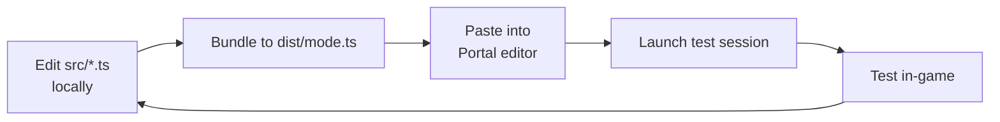

# Build & Deploy

How a Portal mode goes from TypeScript source to a running game session.

## Source layout

A typical mode repo contains:

```
my-mode/
├── src/
│   ├── main.ts                 # Entry point
│   ├── state.ts                # State machine
│   ├── scoreboard.ts           # Scoreboard logic
│   └── ...
├── spatial/
│   ├── MP_Eastwood.json        # Per-map spatial JSON
│   └── MP_Abbasid.json
├── godot/
│   └── ...                     # Godot scene project
├── tools/
│   └── convert_ctf_spatial.py  # Godot → Portal conversion
├── tsconfig.json
└── README.md
```

## TypeScript bundling

Portal expects a single `.ts` file (or a small set) uploaded to the editor. Most modes are written across multiple files for readability and bundled into one before upload.

### Bundle considerations

- **CRLF line endings preserved** through bundling. Most bundlers default to LF — configure explicitly. See [Gotchas § CRLF](gotchas.md#crlf-line-endings-are-required).
- **No smart punctuation** introduced anywhere in the pipeline. Any minifier or comment stripper that "smartens" quotes will break the build.
- **Source maps optional** — Portal doesn't consume them, but they help local debugging.

### Manual concatenation

For very small modes, manual concatenation is fine:

```bash
cat src/state.ts src/scoreboard.ts src/main.ts > dist/mode.ts
```

For anything non-trivial, a real bundler (esbuild, tsc with `--outFile`) saves time. Just make sure CRLF is preserved.

## Uploading to Portal editor

The Portal web editor accepts pasted code (or file upload, depending on the editor revision). The flow:

1. Open the Portal editor at battlefield.com / EA's Portal web app.
2. Open the mode you're iterating on.
3. Paste / upload the bundled `.ts` file.
4. Save the mode.
5. The mode is now uploaded; you can launch a test session.

Editing in the Portal editor's built-in code surface is also possible for quick fixes, but the source-of-truth should always be the local repo. Editor edits get blown away on the next upload.

## Spatial JSON upload

Spatial JSON is uploaded separately from the script. The editor has a slot for it per map. After running `convert_ctf_spatial.py` and committing the output, upload the same JSON to the editor.

If the script and spatial JSON are out of sync (TypeScript expects a named object that doesn't exist in the JSON, or vice versa), the symptom is `mod.GetSpatialObject` returning null and the dependent feature failing silently.

## Test loop



### PC vs. console

Always test on PS5 before declaring a feature done. PC test sessions don't catch:

- `console.log` working / not working differences
- `AreaTrigger` reliability differences
- Some performance-related issues that only surface under console memory/CPU constraints

### Iteration speed

Realistic loop time per iteration is on the order of minutes — bundle, upload, launch session, get into the relevant scenario. Plan accordingly: don't iterate on small things one-at-a-time; batch tweaks.

## Versioning

Tag bundle versions in the file or as a constant:

```ts
const VERSION = "v0.3.0";
ShowBanner(`Mode loaded: ${VERSION}`);
```

This makes it obvious in test sessions whether the upload actually took. (Multiple times in this codebase's history, an upload "succeeded" but the editor served a stale version.)

## Distribution

Once a mode is stable, the Portal experience can be shared via the platform's standard share-mode mechanism. The mode runs from the uploaded version on Portal's servers — the local repo is the development source, but players don't need it.

For internal 189th sharing, link the Portal experience URL in the relevant Discord channel.

## Pre-flight checklist before shipping a build

- [ ] CRLF line endings on every `.ts` file
- [ ] No smart punctuation anywhere in source or comments
- [ ] No lingering `console.log` statements that would spam on PS5 (they're silent there, but every one of them is dead code)
- [ ] Scoreboard column count ≤ 6
- [ ] Every `mod.GetSpatialObject` call has a corresponding entry in the spatial JSON
- [ ] `convert_ctf_spatial.py` was run after any Godot edit
- [ ] No duplicate `ObjId`s in spatial JSON
- [ ] Tested on PS5, not just PC
- [ ] Version constant updated
