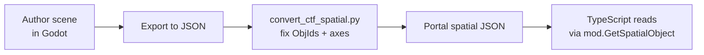

# Godot Workflow

Map layouts (prop placement, trigger anchors, capture points) are authored in Godot and exported as JSON, then converted to the spatial JSON format Portal expects. This pipeline is bespoke — it has gotchas worth documenting.

## Overall flow



## Authoring conventions

### Naming

Every node that the TypeScript will look up needs a stable, unique name. Convention:

```
<Mode>_<Purpose>_<Variant>
```

Examples:

- `CTF_FlagSpawnAnchor_Center`
- `CTF_TeamSwitchMonitor_TeamA`
- `Vendetta_HVTPingAnchor`

The TypeScript code calls `mod.GetSpatialObject("CTF_FlagSpawnAnchor_Center")` with the exact string. Typos here are silent failures — `GetSpatialObject` returns null and the code that uses the result eats it.

### Node types

| Authored as | Used for |
|---|---|
| `ComputerMonitor` (or any visible prop) | Anchors for spawned `InteractPoint` / `AreaTrigger` (since `GetSpatialObject` doesn't return positions for those) |
| `CapturePoint` | Minimap markers (often buried — see [CTF design](../portal-modes/ctf/design.md#buried-capturepoint-minimap-marker)) |
| Spawn region nodes | Team spawn zones |

If you're tempted to author an `AreaTrigger` directly in Godot, don't — the position won't be retrievable. See [API Quirks](api-quirks.md#modgetspatialobject).

## Z-axis must be negated

!!! danger "Godot Z → Portal Z requires sign flip"
    Godot's coordinate convention has the opposite sign on the Z axis from Portal's. Without negation, props authored in Godot end up mirrored along the long axis when loaded into Portal — every prop is on the wrong side of the map.

`convert_ctf_spatial.py` handles this automatically. If you're hand-editing JSON, remember to flip Z.

```python
# In convert_ctf_spatial.py
for obj in spatial["objects"]:
    obj["Position"]["Z"] = -obj["Position"]["Z"]
```

## World position vs. inspector local position

When dragging a prop in the Godot scene editor, the **HUD readout shown during the drag is world position**. The inspector's `position` field after the drag may be a **local** position (relative to a parent node), which is not what you want.

**Always read the world position** when noting coordinates by hand. If your scene tree has nested nodes, the inspector's number is relative to the parent transform — apply the parent's translation/rotation to convert to world.

In practice: avoid nesting prop placement under transforms you don't control. Put props at the scene root.

## `convert_ctf_spatial.py`

The repo's conversion script. Responsibilities:

1. **Negate Z** on every Position (Godot → Portal axis fix).
2. **Renumber `ObjId`** so every object has a unique ID. Duplicate ObjIds break runtime lookups silently — see [Gotchas](gotchas.md#duplicate-objids-break-areatrigger-lookups-silently).
3. Strip Godot-specific metadata that the Portal runtime doesn't understand.
4. Sort objects in a stable order so JSON diffs are reviewable.

Usage (verify against actual script):

```bash
python convert_ctf_spatial.py input_from_godot.json output_for_portal.json
```

Run it every time you re-export from Godot. The output is what gets committed and uploaded.

## Duplicate ObjIds

Two objects with the same `ObjId` in spatial JSON → Portal resolves the lookup to one or the other non-deterministically, **with no error**. The mode behaves as if half its triggers don't exist.

How duplicates happen:

- Duplicating a node in Godot copies the ObjId
- Hand-editing JSON without renumbering
- Merging two spatial JSONs

The conversion script renumbers to prevent this, but if you're hand-editing, run a duplicate check:

```bash
jq '[.objects[].ObjId] | group_by(.) | map(select(length > 1))' spatial.json
```

Output should be `[]`. Anything else is a duplicate.

## Preserving CRLF when editing with Python

If you edit the spatial JSON or any TypeScript file with Python tooling, **read and write in binary mode** to preserve CRLF line endings. Python's text-mode I/O auto-translates line endings to your platform's default, which on macOS/Linux means LF — and LF in `.ts` files breaks the Portal parser.

```python
# Wrong — text mode, will rewrite CRLF as LF on macOS/Linux
with open("spatial.json") as f:
    data = json.load(f)
with open("spatial.json", "w") as f:
    json.dump(data, f, indent=2)

# Right — binary mode, preserves line endings
with open("spatial.json", "rb") as f:
    data = json.loads(f.read())
content = json.dumps(data, indent=2)
with open("spatial.json", "wb") as f:
    f.write(content.encode("utf-8").replace(b"\n", b"\r\n"))
```

For `.ts` files where the line-ending guarantee matters even more strictly, byte-level editing is the safe pattern: read as bytes, modify as bytes (or as a string converted from bytes with explicit encoding/decoding), write as bytes.

## Iteration loop

1. Edit the Godot scene.
2. Export to JSON (Godot's standard export).
3. Run `convert_ctf_spatial.py`.
4. Diff the output to confirm only intended changes (a clean conversion produces a stable JSON).
5. Commit and push.
6. The TypeScript bundle picks up the new spatial JSON on next build/upload.

## When to re-author vs. re-place

If a prop's position needs adjusting:

- **Small tweak (< 1m):** edit the Position field in the JSON directly. Lower friction.
- **Reorganize the layout:** go back to Godot, move the node, re-export, re-convert.

Don't accumulate hand-edits to the JSON if the Godot scene is the source of truth — they'll be wiped on the next re-export. Either commit changes back to Godot or accept that the JSON is now the canonical version.

## Node-type cheat sheet

| Want to... | Use this Godot node | Spawn at runtime? |
|---|---|---|
| Visible static prop | The prop type itself (e.g. `ComputerMonitor`) | No, ships in spatial JSON |
| Interaction prompt | `ComputerMonitor` as anchor | Yes — spawn `InteractPoint` from anchor position |
| Volume detection (PS5-reliable) | `ComputerMonitor` or any prop as anchor | Yes — AABB check in script using anchor position |
| Volume detection (PC only) | `AreaTrigger` directly | No, but only PC-reliable; consider AABB workaround |
| Minimap marker | Buried `CapturePoint` (Y far below floor) | No |
